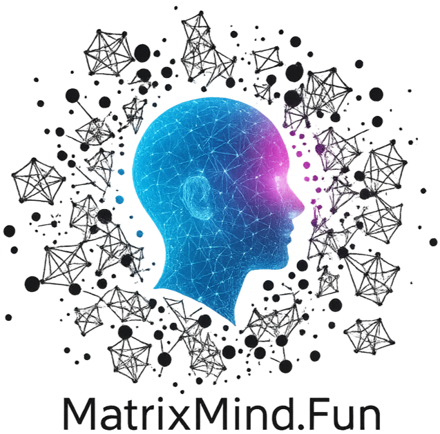

  
  <!-- <h1>MatrixMind.Fun</h1> -->
  <!-- 
这里只有冷静思考，没有浮夸喧哗；这里只有算法与代码，没有装饰和繁杂。
 -->

  

    <a class="mmf-btn primary" href="posts/">开始阅读</a>
    <a class="mmf-btn ghost" href="tags/">按标签浏览</a>
    <a class="mmf-btn ghost" href="projects/">项目</a>
    <a class="mmf-btn ghost" href="about/">关于我</a>
    <a class="mmf-btn ghost" href="https://github.com/zhangxiaochuan" target="_blank" rel="noopener">GitHub</a>
  

<!-- 

  

    <h3>研究与札记</h3>
    
LLM、LoRA、量化与推理优化的实战记录与坑点复盘。

  

  

    <h3>工程与工具</h3>
    
C++ 性能剖析、CI/CD、TensorRT-LLM、GPU pipeline 等工程笔记。

  

  

    <h3>视觉与检测</h3>
    
小目标检测、多模态融合、红外可见等前沿探索与经验沉淀。

  

 -->
