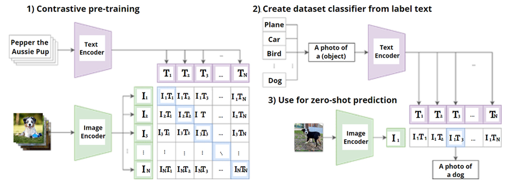

{{ render_tags() }}

## 1. 引言（什么是 CLIP）

**CLIP**（Contrastive Language-Image Pretraining，对比式语言-图像预训练）是 OpenAI 于 2021 年发布的一种多模态模型。它通过**图像-文本对比学习**同时训练图像编码器和文本编码器，将图像与自然语言映射到**共同的嵌入表示空间**。与传统图像分类模型输出固定类别标签不同，CLIP 接受一张图片和一段文本描述作为输入，输出表示二者语义相关性的分数或距离。换言之，CLIP 能判断任意一张图片与任意一段文字描述是否匹配，而无需将图片限制在预定义的类别集合中。这种设计使 CLIP 能直接利用自然语言作为标签，实现**开放领域**的图像识别与检索。

**模型结构：**CLIP 包含两路编码器：一个图像编码器和一个文本编码器。图像编码器可以采用传统卷积网络（如 ResNet）或视觉Transformer（ViT）提取图像特征；文本编码器通常是 Transformer（类似 GPT-系列）将文本转换为向量表示。在编码器输出之后，分别接一层可学习的线性投影，将图像特征和文本特征投影到同一维度的共享嵌入空间。为了让不同模态的表示直接可比，对应的嵌入向量通常会进行 L2 正则化以约束在单位球面上，这样两个嵌入的内积就对应余弦相似度。CLIP 的**输入**包括一组成对的图像和文本描述$(I_i, T_i)$；**输出**则是图像和文本在共同空间中的嵌入向量，以及由此计算出的相似度矩阵。在推理时，我们可以将图像嵌入与任意文本嵌入进行比较，相似度越高表示图片越可能与该文本匹配。通过这种方式，CLIP 能用于开放集的**零样本分类**、跨模态搜索等任务。

**训练目标：** CLIP 的训练任务被定义为：给定一个批次的$N$对图文$(I_i, T_i)$，模型需要预测哪些图像和文本是正确匹配的对。具体来说，对于每个图像$I_i$，配对的文本$T_i$应该在所有文本中获得最高的匹配分数；同样每个文本对其配对图像也应得分最高。为此，CLIP 在训练中使用对比学习的策略，最大化真实匹配对在嵌入空间的余弦相似度，最小化不匹配对的相似度。整个训练通过优化一个**对称的跨熵损失函数**来实现上述目标。对于任意一对$(I_i, T_i)$，定义嵌入相似度$\text{sim}(I_i,T_j)=I_e{(i)} \cdot T_e{(j)}$（通常为内积，已隐含温度参数缩放），则图像$I_i$对应正确文本$T_i$的概率可表示为：

$$
P_{i\to j} = \frac{\exp(\text{sim}(I_i, T_j)/\tau)}{\sum_{k=1}^N \exp(\text{sim}(I_i, T_k)/\tau)} ,
$$

其中$\tau$是**可学习的温度参数**，控制softmax分布的峰度。CLIP 的图像到文本方向损失为所有正确匹配的对数似然：

$$
L_{i2t} = -\sum_{i=1}^N \log \frac{\exp(\text{sim}(I_i, T_i)/\tau)}{\sum_{j=1}^N \exp(\text{sim}(I_i, T_j)/\tau)} .
$$

同理，文本到图像的损失为

$$
L_{t2i} = -\sum_{i=1}^N \log \frac{\exp(\text{sim}(I_i, T_i)/\tau)}{\sum_{j=1}^N \exp(\text{sim}(I_j, T_i)/\tau)} .
$$

**总损失**取两者平均：$L = \frac{1}{2}(L_{i2t} + L_{t2i})$。直观来说，该损失迫使模型将每对正确图文的相似度推高，对每个错误的组合给予低相似度，从而在嵌入空间**拉近**真实匹配的图文向量，**拉远**不相关的图文向量。训练完成后，CLIP 在共同空间学得了图像与文本之间的对齐表示，为各种下游任务提供了**通用且可迁移的特征**。



图 1：CLIP的整体架构与任务示意。（1）对比式预训练：在每个训练批次，CLIP 接收$N$对图像和文本，将它们分别编码为图像特征$I_i$ 和文本特征$T_j$，计算得到$N\times N$ 的相似度矩阵$I_i \cdot T_j$。训练目标是让对角线上的真实匹配对（如$I_1$-$T_1$）的相似度高于其他非匹配组合。（2）从类别标签文本构造数据集分类器：将目标数据集的类别名插入模板（如 "A photo of a {object}."）生成文本描述，通过 CLIP 的文本编码器得到各类别的文本嵌入。（3）零样本预测：给定一张待分类图片，用图像编码器获得图像嵌入，与所有类别文本嵌入计算相似度，选择分数最高的类别作为模型预测。

## 2. 背景及动机（为什么需要 CLIP）

_“典型的视觉模型往往各自为战且高度依赖人工标注数据，这限制了它们的通用性和可扩展性”。_ 在 CLIP 出现之前，计算机视觉领域主流的方法是使用**限定类别**的人工标注数据集（如 ImageNet）训练分类网络。这带来了几大局限：

+ **数据集狭窄且昂贵**：高质量的标注图像数据集制作成本高且涵盖概念有限，每个数据集只能教会模型一小部分视觉概念。一旦需要识别新类别，就必须收集新数据并重新训练特定模型。
+ **模型迁移能力弱**：传统监督模型通常**专注单一任务**，难以适应新任务或新领域。例如，用 ImageNet 训练的分类器在未见过的类别上几乎无法直接泛化，需要经过微调才能应用到不同数据集。这使得模型的**通用性和零样本能力**很差。
+ **鲁棒性问题**：在基准测试上表现优异的模型，在分布外数据或干扰条件下表现会显著下降。研究发现许多监督模型在对抗样本、分布迁移等“压力测试”下性能崩溃。这对模型的实用性和对深度学习方法的可靠性提出质疑。

**多模态对齐的必要性：****为了突破上述局限，研究者认识到需要一种能够利用****海量非结构化数据**的新范式。自然语言作为标签具有无限的灵活性和信息量，可以描述任何视觉概念。如果模型能**直接从网络中丰富的图像-文本对**中学习，就不再局限于人工定义的狭窄类别集合。在 NLP 领域，预训练语言模型（如 GPT 系列）正是通过在海量文本上学习通用表示，实现了跨任务的零样本迁移。这种启发促使视觉领域探索类似的方法：将**自然语言监督**引入视觉模型训练，以获得更具泛化能力的视觉表示。

**CLIP 的范式转变：****CLIP 正是在这一背景下提出，代表了一种“预训练+提示”的新范式，被誉为视觉领域的****“GPT 时刻”**。不同于传统直接预测固定标签，CLIP 将**文字嵌入作为输出空间**，使模型可以通过输入自然语言指令来执行识别任务。这样一来，**零样本学习**成为可能：给定全新的分类任务，只需提供各类别的文本描述，CLIP 即可在无需额外训练的情况下完成分类。例如，OpenAI 报告显示，CLIP 的 ResNet-50 模型在**未使用任何 ImageNet 训练样本**的情况下，零样本分类准确率匹配了原始ResNet-50在 ImageNet 上的水平。这意味着无需为每个新任务收集标注数据，模型即可通过语言接口灵活泛化到新领域。

此外，CLIP 引入了**Prompt Engineering（提示工程）** 的概念来提升零样本性能。具体做法是为文本编码器设计合理的模板（如在类别名前添加"a photo of a ..."，而非直接使用单词），以提供更多上下文。这种技巧可以有效提高模型判别细粒度类别的准确性。研究表明，相比直接使用单独的类名，精心设计提示和集成多个提示可使零样本分类准确率提高约5个百分点。

总之，CLIP 带来的**范式转移**在于：模型不再局限于预定输出空间，而是通过对齐图像和自然语言，实现“一模多用”。这极大提升了视觉模型的**通用性、可迁移性和鲁棒性**。在超过30个各异的数据集上，CLIP 的零样本迁移性能与有监督模型相当，且对分布偏移更加稳健。可以说，CLIP 将计算机视觉从专门的封闭任务拓展为开放词汇空间，从而开启了跨模态理解的新篇章。

## 3. 实现细节（如何训练 CLIP）

**训练数据：** CLIP 的成功很大程度上依赖于大规模的训练语料。OpenAI 使用了来自互联网上的约 **4亿对图像-文本对**作为训练数据。这些图文对并非人工标注，而是利用网络上的现成描述（如图片的标题、周边文本等）自动收集，因此数据覆盖面极广但也相对嘈杂。与精心清洗的小型数据集不同，CLIP 大胆采用了**海量弱标注数据**，并凭借数量取胜：即使包含噪声，丰富多样的样本也足以让模型学到稳健的图文映射关系。事实证明，在如此规模的数据上训练，对过拟合的担忧反而降低，因此无需使用过多复杂的正则化或数据增广技巧。

**模型架构：如前所述，CLIP 由独立的图像编码器和文本编码器构成，它们在训练过程中权重不共享**。OpenAI 尝试了两类图像编码器架构：一是改进版的 ResNet（例如 ResNet-50x4、x16 等宽度加大的变体）；二是 Vision Transformer (ViT) 系列。ResNet 版本融入了一些优化（如ResNet-D和抗混叠池化）以提升性能；ViT 版本则基本沿用原始 ViT 的设计，只在拼接Patch嵌入后增加了一层 LayerNorm 并调整初始化策略。文本编码器使用一个12层、宽度512的 Transformer，参数约6300万。文本首先经过 Byte Pair Encoding (BPE) 得到词序列（词表大小约49万），序列长度上限为76。在Transformer编码时，采用与GPT类似的架构（包含[SOS]和[EOS]标记，最终抽取 [EOS] 位的顶层隐状态作为文本表示）。需要注意，文本编码器采用了**单向掩码自注意**（即因果Mask），以便保持与预训练语言模型初始化兼容的可能性。图像和文本编码器各自输出的高维特征（如图像特征维度$d_i$，文本特征维度$d_t$）通过线性层投影到统一的嵌入维度$d_e$，再经逐行$L_2$正则化，得到图像嵌入$I_e$和文本嵌入$T_e$。最终计算两者的点积相似度，再乘以$\exp(t)$作为 logits。这里的$t$即**可学习温度**参数的对数值，模型会自动调整它来控制分布的熵高低。

**训练流程**：CLIP 的训练本质上是在做一个大型的 N 对 N 的多分类任务。每个训练步从数据集中取出$N$对图文，送入编码器得到$N$个图像嵌入$I_e$和$N$个文本嵌入$T_e$。计算所有图像-文本嵌入对的余弦相似度，形成一个$N\times N$的相似度矩阵。理想情况下，该矩阵的主对角线元素（表示匹配的图文对）应远大于非对角元素（表示错配的组合）。为了实现这一点，采用上述对称跨熵损失$L$来更新模型参数。每个批次的损失由图像作为查询和文本作为查询两个方向的跨熵之和构成。在实现上，可将相似度矩阵的第$i$行通过 softmax 转换为图像$I_i$对各文本属于匹配的概率分布（第$i$行正确标签就是位置$i$），并对数损失；第$i$列同理表示文本$T_i$对各图像的匹配概率并损失。两个损失平均即为最终目标。OpenAI 在论文中提供了核心训练逻辑的伪代码：

```python
# 图像编码器 - ResNet 或 ViT
# 文本编码器 - Transformer（GPT样架构）
# I[n, ...]  - 包含 n 张图像的批次
# T[n, ...]  - 包含 n 段文本的批次（与图像一一对应）
# W_i[d_i, d_e] - 图像特征到嵌入空间的投影矩阵
# W_t[d_t, d_e] - 文本特征到嵌入空间的投影矩阵
# t    - 可学习的温度参数 (log-scale)
I_f = image_encoder(I)        # 提取图像特征，形状 [n, d_i]
T_f = text_encoder(T)         # 提取文本特征，形状 [n, d_t]
I_e = normalize(I_f @ W_i, axis=1)   # 投影并 L2 归一化图像嵌入 [n, d_e]
T_e = normalize(T_f @ W_t, axis=1)   # 投影并 L2 归一化文本嵌入 [n, d_e]
logits = I_e @ T_e.T * exp(t)       # 计算图文相似度矩阵并应用温度缩放 [n, n]
labels = arange(n)
loss_i = cross_entropy_loss(logits, labels, axis=0)  # 图像->文本 的交叉熵损失
loss_t = cross_entropy_loss(logits, labels, axis=1)  # 文本->图像 的交叉熵损失
loss = (loss_i + loss_t) / 2    # 对称损失取平均
```

代码说明：`logits[i][j] = `$I_e^{(i)} \cdot T_e^{(j)} * \exp(t)$表示第$i$张图与第$j$段文本的相似度分数。`labels = arange(n)` 生成0到$n-1$的标签向量，表示第$i$行（图像$I_i$）的正确匹配文本索引为$i$，第$j$列（文本$T_j$）的正确匹配图像索引为$j$。`loss_i` 对每一行执行 softmax 及交叉熵，确保$I_i$在第$i$列（匹配$T_i$）取得最大概率；`loss_t` 类似按列计算，确保$T_i$匹配$I_i$的概率最大。两个损失平均即得到对比学习的目标。这个目标等价于 InfoNCE 损失的一个变体：最大化匹配样本的对数似然，同时最小化错配样本的相似度。

**训练超参数：CLIP 的训练规模非常大，OpenAI 在论文中提到使用了 32,768 的超大批次进行对比学习，并训练了 32 个 epoch。优化器采用 Adam 配合余弦退火学习率调度，初始学习率等超参通过在ResNet-50上网格搜索确定，然后针对更大模型缩放调整。温度参数 **$\tau$** 初始化为 0.07（对应 **$t=\ln(0.07)$**），并在训练中作为参数直接优化（限制 **$|t|<\ln(100)$** 以保证稳定性）。如此大的批次和数据，使得模型训练需要巨大的算力支撑（据报道OpenAI使用了256个V100 GPU并行训练2周以上）。为加速训练和节省显存，作者使用了混合精度和梯度检查点等技巧。尽管实现复杂，但由于对比学习不需要人工标签，这一过程充分利用了海量数据的监督信号，使模型学习到高度可迁移的图像表示**。

## 4. 多模态模型的发展脉络

CLIP 的提出既有前人的技术铺垫，也引领了后续一系列扩展改进。下面简要梳理 CLIP **之前**和**之后**有代表性的多模态模型方法，以及它们的特点与进展。

### 4.1 CLIP 之前的代表性多模态方法

+ **VSE++ (2018)**：全称为 Visual-Semantic Embeddings++，是早期图文联合嵌入的方法。VSE++ 提出了在**三元组损失**中引入**难负样本挖掘**，强化错配图文对的区分度，从而显著提高了图像描述检索的精度。模型使用独立的图像和文本编码（如预训练ResNet提取图像全局特征，LSTM提取文本特征），通过正匹配对的距离最小化、随机负样本对的距离最大化来学习共同空间表示。实验表明，相比不考虑难负例的基线，VSE++ 在 MS-COCO、Flickr30K 等图文检索任务的评价指标上有大幅提升。它证明了**对比损失+难样本挖掘**在跨模态检索中的有效性，是 CLIP 等后续工作的早期启发之一。
+ **ViLBERT (2019)**：是将 BERT 扩展到视觉和语言双模态的模型。ViLBERT 采用**Two-Stream（双流）架构**，即图像和文本各有一套自注意力编码器，二者在若干层通过**Co-attention（协同注意）****交互。具体实现上，图像通常以****区域特征**表示（利用预训练的目标检测模型如 Faster R-CNN 提取多个对象区域的视觉特征），文本以词序列表示，两路在中间层通过特殊的互注意力单元让图像区域和词语交互计算关注权重。这种结构在保持单模态编码器各自预训练能力的同时，实现了细粒度的跨模态对齐。ViLBERT 在VQA（视觉问答）、VR（视觉推理）等任务上取得当时最佳成绩，展示了**双流跨模态Transformer**的强大建模能力。
+ **VisualBERT (2019)**：与 ViLBERT 不同，VisualBERT 采用**Single-Stream（单流）架构**，将图像和文本信息直接拼接后输入同一个 Transformer 编码器。它相当于在原始 BERT 模型中加入视觉词：每幅图像用若干对象区域特征向量表示，并附加上类型嵌入以区分视觉/文本模态，再与文本序列一起输入Transformer。Transformer 自注意力机制能够在单流架构中自动学习图像区域与单词之间的对应关系。VisualBERT 通常以 COCO 等图文描述数据集进行预训练（任务包括图文匹配判别、遮罩语言模型等），然后微调到下游任务。它在图文检索、VQA等任务上取得了很强的性能，证明了**联合编码**多模态特征的可行性。
+ **UNITER (2020)**：全称 UNiversal Image-TExt Representation，是单流架构的进一步发展。UNITER 将多个图文数据集（COCO, Visual Genome, Conceptual Captions 等共900万对图文）联合预训练，通过多任务学习（包括遮罩语言建模、遮罩图像区域预测、图文对齐判别、词-区域对齐等任务）来提升跨模态表示的鲁棒性。与VisualBERT相比，UNITER 数据更大且训练目标更丰富，使其在下游任务（如VQA、图文检索、推理等）上全面超越先前模型。当时UNITER 在多项Benchmark上刷新SOTA，被视为跨模态预训练的一座里程碑。它表明，通过**联合大规模数据和多任务训练**，可以学到通用的跨模态表示，为后来的CLIP提供了经验借鉴。

### 4.2 CLIP 之后的改进与拓展方法

+ **ALIGN (2021, Google)**：与 CLIP 几乎同期出现的一项工作，全称“A Large-scale Image and Noisy Text embedding”。ALIGN 的核心思想与 CLIP 相似：采用**双塔式**（dual-encoder）的图像编码器+文本编码器结构，优化跨模态对比损失，将图文映射到共同空间。其突出亮点在于利用了规模更大的 **1.8B（十八亿）对图文数据**，这些数据来自网络爬取的图像alt文本，未经严格清洗。谷歌研究人员证明，即使数据非常嘈杂，极大的数量也能弥补质量不足，从而训练出更强的模型。ALIGN 使用 EfficientNet-L2 作为图像编码 backbone、BERT-Large 作为文本编码，模型参数规模高达8亿。实验显示，ALIGN 在图文检索等任务上比同时期的 CLIP 更胜一筹，在 Flickr30K、COCO 检索中取得新的零样本 SOTA。ALIGN 表明，简单的对比学习策略在数据和模型规模上仍有巨大潜力，通过大数据“粗养”，跨模态模型性能可以进一步提升。
+ **SLIP (2021, Facebook/Berkeley)**：全称“Self-Supervision meets Language-Image Pre-training”，提出将**自监督视觉预训练**与 CLIP 的图文对比学习相结合。SLIP 在训练时增加了一支 SimCLR 风格的图像-图像对比损失：对每张图像除原始视图外再随机数据增强生成另一视图，两视图通过SimCLR损失学习图像内部表征。同时，第三视图与文本构成原始CLIP损失。最终总损失是图像-文本对比和图像-图像自监督的加权和。通过多任务训练，SLIP 获得的图像特征比单纯CLIP更强，在相同数据上 SLIP 在零样本分类、线性评估、微调三种评测下均超过 CLIP。这说明加入图像自监督信号能提高图像编码器的泛化性能，即使语言监督数据规模不变，也能进一步提升表示质量。SLIP 特别有利于中等规模数据集的训练情境，被认为是对比学习和自监督学习的有效融合探索。
+ **BLIP (2022, Salesforce)**：全称“Bootstrapping Language-Image Pre-training”，旨在统一**视觉-语言理解和生成**两类任务的预训练框架。与 CLIP 等只针对理解任务不同，BLIP 通过设计多元损失，既适用于检索、VQA等判别任务，又能用于图像描述生成等生成任务。其创新在于**自举式数据优化**：先用一个现有图像描述模型（captioner）为网络图文数据生成更准确的描述，再用过滤器去除噪声描述。通过这种方式，BLIP 在利用 web 噪声数据时获得更高的信噪比。预训练中，BLIP 同时优化图文对比损失、图文匹配分类损失以及图像条件下的语言模型损失，实现单一模型兼具判别和生成能力。实验表明，BLIP 在多项视觉语言任务上取得当时最好成绩（如零样本图文检索提升+2.7% R@1，图像描述提升+2.8 CIDEr，VQA提升+1.6%）。并且无需微调就能将模型迁移到视频-语言任务上取得优异表现。BLIP 是多模态模型朝**通用多任务**方向发展的重要一步。
+ **Florence (2021, Microsoft)**：代号为“Florence”，是微软提出的新一代视觉-语言基础模型。Florence 的图像-文本预训练数据集规模达 **9亿对**（称为 FLD-900M），模型采用 CLIP 类似的双塔结构，但使用更大的 CoSwinTransformer 作为图像编码器、12层Transformer作为文本编码器，总参数高达 8.93亿。训练方法上，引入了一种统一对比学习损失（UniCL），将图像-文本对映射为 (x, t, y) 三元组，其中 y 是由哈希得到的“语义标签”，所有映射到同一 y 的对被视为正例，实现**多对多**的对比学习。此外，Florence 通过两阶段训练缓解提示模板带来的不一致影响，先用带随机提示的数据训练，再二次训练去除提示数据。得益于超大规模数据和模型，Florence 在各项任务上取得突出成绩：零样本 ImageNet 分类 **83.7%** 准确率，较当时 SOTA 提升5.6个百分点；跨12个分类任务9个居首，跨模态检索也全面超越先前模型。Florence 还通过适配头扩展实现了物体检测、VQA等任务的领先表现。可以将其视作CLIP思路在工业级数据和模型规模上的极致延伸，展示了**基础模型**在视觉领域的威力。
+ **Flamingo (2022, DeepMind)**：Flamingo 是一种支持**少样本学习**的视觉语言模型系列。它的目标是使模型能通过几幅图像和对应文本的示例“上下文”快速适应新任务。Flamingo 的架构巧妙地**衔接预训练的单模态模型**：将一个强大的图像编码器（如预训的CLIP视觉 backbone）和一个大型语言模型（如预训Transformer LM）连接起来。具体实现上，在冻结原有单模态模型的基础上，插入若干**跨注意力层**，让语言模型能够以图像编码器输出作为键值来关注图像内容。这样，Flamingo 可以处理任意交错的图像和文本序列输入，并在生成答案时灵活地参考视觉信息。训练时，Flamingo 利用大量图文交错的数据进行序列建模，使其具备**上下文推理**能力。在评测中，一个单一的Flamingo模型通过在提示中提供少量示例（无需梯度更新），就在多项开放式任务上达到新的 SOTA：例如在各种 VQA、图像字幕、视觉推理基准上，Flamingo 的 few-shot 表现超越了那些使用大量标注微调的专门模型。这证明了通过**融合多模态预训练和提示学习**，模型可以获得惊人的跨任务泛化能力。Flamingo 标志着跨模态模型开始迈向类 GPT-3 的**提示驱动**范式，在多模态 few-shot 学习方面取得突破。

## 5. 应用案例与场景

CLIP 作为多模态基础模型，在学术研究和工业应用中展现了广泛的用途。以下列举若干典型的应用场景：

+ **零样本图像分类：**这可能是 CLIP 最引人注目的应用之一。利用 CLIP，我们可以在没有针对目标任务的专门训练数据情况下，对新领域的图像进行分类。具体做法如前文所述：针对给定数据集的类别集合，先构造每个类别的文本描述（通常使用提示模板，如 "A photo of a cat." 等），通过 CLIP 文本编码器得到各类别的嵌入。对于待分类图片，用图像编码器获得图像嵌入，计算与所有类别文本嵌入的相似度。图像被归入相似度最高的那一类，从而完成预测。OpenAI 报告中，CLIP 在包含1000类的 ImageNet 上零样本分类达到与有监督ResNet-50相当的 76.2% Top-1 准确率；在包括 OCR、行为识别、细粒度分类等30多个数据集上，零样本 CLIP 模型的性能大多接近甚至超过经过该数据集微调的监督模型。值得一提的是，通过精心挑选和扩充提示（prompt engineering）以及对多个提示结果取平均，零样本分类精度还可进一步提升。这一能力在现实中具有重要意义：无需收集新数据即可快速扩展模型到新的识别任务，大幅提高了视觉系统的灵活性和实用性。
+ **图文检索与匹配：**CLIP 提供了一个自然的跨模态检索方案：利用共同的嵌入空间，可以将文本作为查询搜索图片，或反过来以图像查询相关文本。具体而言，先对一大批图片计算并存储 CLIP 图像特征向量；给定一段查询文本，用文本编码器得到向量，在数据库中检索最近邻的图像向量，即可返回与该描述最匹配的图片（文本->图像检索）。同样，可以用一张图片编码后在海量文本向量中查找最相似者，实现以图找文（图像->文本检索）。由于 CLIP 的训练涵盖了广泛的视觉语义概念，它能处理开放域的描述。例如用一句话“猫躺在沙发上”检索，结果往往是真正含有猫和沙发的图片，即使这些图片可能不在任何传统标注数据集中。这为构建多媒体搜索引擎提供了新工具。一些开源项目（如 **CLIP Retrieval**）已经实现了利用 CLIP 对上亿图像建立索引、实现文本搜图的系统。实验显示，相比基于标签的旧方法，CLIP 的检索结果在语义相关性上有明显提升。因此，CLIP 被广泛用于视觉语义检索、相似图片推荐、内容审核（找出不符合描述的图片）等应用中。
+ **文本引导的图像生成：**CLIP 还能用来提升图像生成模型的效果，即通过 CLIP 提供的语义反馈来指导生成过程。一个著名范例是 VQGAN+CLIP：VQGAN 是生成模型，CLIP 则作为“审评者”。生成模型不断产生产出候选图像，CLIP 负责判断这些图像与目标文本描述的匹配程度（计算 CLIP 相似度）。然后利用这个相似度作为优化信号，反向更新生成模型的图像 latent 使之更接近文本语义。通过 CLIP 的引导，VQGAN 能逐步绘制出符合文字描述的图像。人们用这种方法创造了许多惊艳的 AI 艺术作品，也验证了 CLIP 嵌入空间对高层语义的把握。除了 VQGAN，扩散模型等生成技术也借鉴类似思路，如在生成过程中计算生成图像与目标文本的 CLIP 得分并加权融入采样过程，能够提升生成图像与文本的相关性和写实度。实际上，OpenAI 的 DALLE-2 模型就利用了 CLIP：先训练一个将图像编码为 CLIP 空间的先验模型，然后引导扩散生成。因此，CLIP 不仅擅长判别，还可以作为跨模态的评价函数嵌入到生成模型中，帮助实现“AI 作画”等应用。
+ **通用特征提取与下游微调：**由于 CLIP 学到了强大的视觉表征，不少应用直接把 CLIP 的图像编码器当作预训练骨干，用于传统视觉任务上以提升效果。例如，将 CLIP 的图像特征用作下游模型的输入，再在小规模有标签数据上训练一个轻量分类器（即线性探针），往往比从头训练或使用ImageNet预训模型得到更高精度。OpenAI 的研究显示，在有限数据场景下，CLIP 比同等精度的有监督模型更加稳健。另外，在目标检测、图像分割等任务中，也有工作将 CLIP 特征融入（例如为每类目标提供文本描述嵌入，辅助检测器识别开放集目标）。CLIP 的文本编码器同样可以用来提取句子嵌入，在多模态对话、图文问答系统中与图像特征配合工作。甚至在机器人领域，CLIP 被用于感知模块：输入摄像头画面和指令，CLIP 计算相似度帮助机器人理解要抓取的物体类别。总体而言，CLIP 提供了一个通用嵌入空间，许多任务都可以在该空间中利用相似度度量来替代或辅助传统的分类器，从而实现更强的零样本或少样本能力。随着开源实现和模型权重的发布，工程师和研究者已将 CLIP 集成到各种应用中，极大加速了多模态 AI 技术在现实中的落地。

**结语：** OpenAI 的 CLIP 模型开创了图像与自然语言联合预训练的新范式。通过对比学习，CLIP 获取了跨模态对齐的强表征能力，在无需特定训练数据的情况下就能执行零样本图像识别和检索。其后的大量研究和应用进一步验证了这一思路的价值——结合海量数据和语言监督，视觉模型的通用性与智能水平取得了质的飞跃。可以预见，随着更大规模的多模态模型（如 Flamingo、GPT-4V 等）的出现，人工智能系统将能以更接近人类的方式理解和联通视觉与语言信息，为多模态信息处理和决策带来前所未有的能力提升。
