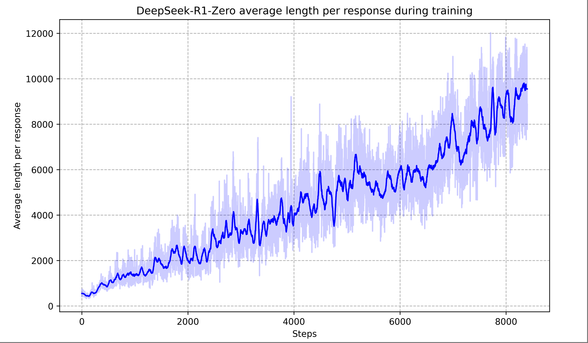

## 研究动机与背景

近年来大型语言模型（LLM）的推理能力成为研究热点。OpenAI等公司通过扩展推理链（Chain-of-Thought, CoT）的长度，提高了模型在数学、编程等复杂任务上的表现。OpenAI内部的“o1”系列模型率先在**推理时**通过延长思维链取得显著效果；然而，这种**推理长度扩展**的有效性如何在通用测试时保持依然是悬而未决的问题。学界也在探索不同方法增强LLM推理能力，包括**过程级奖励模型**（对推理过程逐步评分）、**强化学习**(RL)策略，以及搜索算法（如蒙特卡洛树搜索 MCTS 或 Beam Search）。然而，这些尝试都未能达到 OpenAI o1 系列模型的综合推理水准。

**研究动机：**上述背景下，DeepSeek 团队提出问题：**能否不用任何监督微调数据，仅通过大规模强化学习显著提升LLM的推理能力？** 监督数据的获取代价高昂，而且以往我们的工作也表明过度依赖监督数据。因此，作者希望探索**纯RL**训练LLM推理的潜力，鼓励模型在强化学习过程中自我进化出推理能力。这一方向的意义在于，如果成功，将证明**无需人工标注过程，LLM也可通过奖励信号自发学会复杂推理**。同时，作者受到OpenAI o1模型启发，希望开源一个性能可媲美闭源模型的推理LLM，为社区提供研究和应用基础。

## 方法论详解

本论文提出了**DeepSeek-R1**系列模型，包括**DeepSeek-R1-Zero**和改进版**DeepSeek-R1**。核心思路是在一个大型基础模型上，利用**强化学习（reinforcement learning）策略优化**来激励模型产生更强的推理行为，同时结合少量高质量数据和多阶段训练流程来提升模型可读性和通用性。下面分别从模型架构、训练流程、奖励设计和思维链策略四方面详解其方法论。

### 模型架构（DeepSeek-R1）

**基础模型：** 作者以自家的 DeepSeek-V3-Base 作为初始基础模型（参数规模约37B激活参数，底层为Mixture-of-Experts架构）。在此基础上，他们构建两个版本：

* **DeepSeek-R1-Zero：** 直接在基础模型上进行纯强化学习训练**(无任何监督微调)**得到的模型。R1-Zero证明了纯RL可以赋予模型强大的推理能力。
* **DeepSeek-R1：** 在 R1-Zero 的经验基础上，通过**引入少量高质量冷启动数据**和**多阶段训练Pipeline**进一步提升性能和可用性的模型。相比于 R1-Zero，它在训练开始前先进行了一个小规模的有监督微调（冷启动），然后才执行大规模RL，并在中后期结合了额外的监督数据和再次RL，形成一个**四阶段**训练流程。

**多阶段训练Pipeline：** DeepSeek-R1 的训练包含以下阶段：

1. **冷启动微调 (Cold Start SFT)：**收集数千条高质量、带有详细思维链（CoT）的解题示例数据，对基础模型进行有监督微调，得到初始策略模型。这些冷启动数据特别关注**可读性**（确保推理步骤清晰、有Markdown格式、结尾有总结）以及引入**人类先验**（如在回答末尾提供总结等），以弥补纯RL直接训练时模型内容可读性差、混杂多语言等缺陷。
2. **第一阶段强化学习 (Reasoning-oriented RL)：**在冷启动后的模型上，对**数学、代码、逻辑推理**等有明确客观标准的任务进行大规模RL训练。采用**群体相对策略优化**(Group Relative Policy Optimization, GRPO)算法来高效更新策略，并使用**规则奖励**（判断答案正确性和格式）引导模型更好地完成推理任务。此阶段着重提升模型的**思维链长度和正确率**。训练过程中，模型自然倾向于在推理时生成更长的思维链，从最初仅输出短答案逐步进化到输出数百上千个推理标记，显著深化了解题步骤。经过数千步RL训练，DeepSeek-R1-Zero在AIME数学竞赛等基准上的Pass@1准确率从**15.6%**跃升至**71.0%**，已经接近OpenAI-o1-0912模型；再通过多数决策略，可进一步提高到**86.7%**，超越OpenAI-o1-0912。
3. **第二阶段监督微调 (Rejection Sampling SFT)：**当第一阶段的RL训练趋于收敛后，作者冻结模型，用其**生成新数据**来扩大训练集，然后再微调模型。具体而言，一方面针对**推理类任务**，利用当前模型产生的思维链答案执行**拒绝采样**：对每个问题生成多个解答，**筛选出正确且格式良好的回答**。为判别正确性，有的直接用规则（如数学答案比对），有的引入**生成式奖励模型**，从而获取约**60万条**高质量思维链数据。另一方面针对**非推理任务**(如写作、问答、角色扮演等)，部分复用DeepSeek-V3的已有监督数据，并让DeepSeek-V3先产生日志式思维链再给最终答案，以提升这些任务的数据质量。最终汇集约**80万条**新数据（含约60万推理类+20万非推理类），再对模型进行两轮微调。这一阶段使模型拓展能力领域，并提升输出的**流畅性和多样性**。
4. **第三阶段强化学习 (RL for All Scenarios)：**最后，作者进行第二轮RL训练，使模型在**对齐人类偏好**的同时巩固推理能力。此阶段同时针对**推理类**和**常规对话类**场景：对于数学、编码等**有客观标准**的推理任务，仍沿用规则奖励（正确性验证 + 语言一致性等）；对于开放问答、助理对话等**主观任务**，引入训练好的**偏好模型**作为奖励函数，以衡量回答的有用性（helpfulness）和无害性（harmlessness）。具体地，偏好模型只关注回答最终的**总结部分**来评估有用性，以免干扰模型推理过程；而在无害性方面，则对模型完整响应（包括推理过程和结论）进行评估，避免任何潜在有害内容。通过整合**规则+偏好**多种奖励信号，并混合多领域的提示进行训练，模型最终得到全面优化。经过此阶段得到的最终模型即**DeepSeek-R1**，在多项推理基准上达到与OpenAI-o1-1217相当的水平。

此外，作者还将DeepSeek-R1的推理能力**蒸馏**到若干小模型中。他们选择了开源模型Qwen2.5和Llama3系列（参数1.5B至70B不等）作为初始模型，仅用上一步生成的80万新数据进行微调（不再进行RL训练）。有趣的是，直接蒸馏大模型的推理模式到小模型，效果**优于**对小模型进行RL训练得到的结果。这表明**大型模型中学到的推理模式**对于提升小模型能力至关重要，简单微调即可胜过小模型自身通过RL摸索的模式。最终作者开源了从DeepSeek-R1蒸馏而来的多个尺寸模型（1.5B, 7B, 8B, 14B, 32B, 70B），为社区提供高性能的**稠密小模型**推理能力基础。

### 强化学习训练流程

**RL算法：** DeepSeek-R1 系列的训练核心是**群体相对策略优化（Group Relative Policy Optimization, GRPO）**算法。GRPO是对传统PPO的一种改进：它**不使用单独的价值函数网络**（critic）估计基线，而是通过**采样一组旧策略模型的输出**来估计当前策略的相对优势。具体而言，对于每个给定的问题，先用旧策略生成一组回答（如N个不同解答），根据每个回答的奖励$r_i$计算出该组的平均奖励$\bar{r}$，然后将每个回答的优势$A_i$定义为 $A_i = r_i - \bar{r}$。优化目标是最大化新策略对这些回答的对数概率加权的期望：
$J(\theta) = \mathbb{E}_{a_{1:N}\sim \pi_{\text{old}}}\left[\sum_{i=1}^N \log \pi_\theta(a_i|x)\,A_i\right],$
同时在实现中加入类似PPO的限制（例如KL散度约束）以保证更新稳定。通过这种方法，GRPO**用一批样本自身的平均表现当作基线**，既节省了训练一个同规模价值模型的开销，又充分利用了群体反馈进行稳定更新。作者采用GRPO对模型进行大规模RL微调，在数千步更新后，观察到模型涌现出许多强大的推理行为和性能跃升。

**训练设置：** RL训练主要在**数学、编程、逻辑推理**等任务上进行，因为这些任务有明确的**客观奖励信号**（如答案对错可判定）。每次迭代中，模型针对给定问题输出带思维链的答案，利用预先设定的规则计算奖励，然后根据GRPO算法调整模型参数。为保证模型在推理过程中**遵循指定格式**，作者在RL对话模板中要求助理将“思考过程”和“最终答案”分别输出在 `<think>...</think>` 和 `<answer>...</answer>` 标签内。此外，设置了**格式奖励**鼓励模型严格遵守这种格式。整个RL训练分两大阶段进行：首先是仅关注推理任务正确率和格式的**推理强化学习阶段**，其次是在引入更多任务和偏好模型后的**全场景强化学习阶段**。在第二阶段RL中，针对模型推理过程中出现的**多语言混用**问题，作者还额外设计了**语言一致性奖励**：计算推理链中目标语言（如英文或中文）的词占比，将其作为奖励的一部分。尽管加入该项奖励可能略微降低模型在一些指标上的分数，但显著提升了思维链对人类的可读性和单一语言连贯性。最终综合**准确性奖励 + 语言一致性奖励**作为总奖励来训练模型，直至在主要推理任务上收敛。

**奖励模型设计：** DeepSeek-R1 的奖励设计遵循**先简单后复杂、能规则就不神经**的原则。在初始的纯RL阶段（训练 R1-Zero）中，作者**完全不使用训练得到的神经网络奖励模型**，而是采用了**纯规则型奖励**：

* **准确性奖励（Accuracy reward）：** 针对有标准答案的任务，检查模型给出的最终答案是否正确。如果正确则给予正奖励，错误则不给予。例如，数学计算题要求模型把最后答案用特定格式（如 `$\boxed{42}$`）给出，这样程序可以直接匹配验证结果是否正确。又如编程题，可以将模型输出的代码运行测试用例，看是否通过，以此评估正确性。
* **格式奖励（Format reward）：**鼓励模型将**思维过程**和**答案**分别放在预定标签内（`<think>` 和 `<answer>`），惩罚不符合格式的输出。这保证了模型**显式输出推理过程**，便于阅读和后续处理。

作者特意**未采用任何基于神经网络的过程/结果奖励模型**，因为他们发现使用学习得到的奖励模型在大规模RL过程中容易出现**奖励滥用（reward hacking）**问题。此外，训练和更新一个复杂的奖励模型需要额外的算力，并增加了整体Pipeline的复杂度。因此，R1-Zero阶段纯粹依赖**规则判别**来提供反馈信号，既简单有效又避免了模型学会投机取巧 maximization。

在后续的DeepSeek-R1训练中（即引入冷启动数据后），由于需要模型具备更好的**多任务表现和对齐人类偏好**，奖励设计也相应丰富：

* 在**推理任务**上，继续沿用规则准确性奖励，并加入上述**语言一致性**奖励，确保推理链清晰单语表达。
* 在**通用对话任务**上，引入预训练好的**人类偏好奖励模型**，分别度量回答是否有帮助（helpful）和无害（harmless）。训练时对于每个回答，既计算来自**偏好模型**的得分，又计算推理类问题的规则得分，将二者适当加权作为最终奖励。值得注意的是，有帮助度仅考察最终答案部分，以免模型为了迎合奖励在推理过程中产出迎合性内容；而无害性则针对完整响应评估，以杜绝思维链或答案中出现不当内容。这种设计使模型在保持推理能力提升的同时，也学会输出用户更满意、安全的答案。

总体而言，DeepSeek-R1 的奖励体系先后经历了**规则奖励 → 规则+偏好奖励**的演进。初期用**硬规则**引导模型掌握基本推理和格式能力，中期结合**语言偏好**提升可读性，后期融入**软偏好模型**实现价值观对齐和通用能力提升。通过这种逐步复杂的奖励设计，模型既获得了**客观任务正确性**，又兼顾了**主观用户满意度**。

#### 不同阶段的奖励权重平衡

在训练中，这些奖励不是“一锅乱炖”，而是分阶段逐渐引入，并在不同阶段有不同的权重设置：

1. **R1-Zero 阶段（纯RL）**
      * 只使用 **准确性奖励 + 格式奖励**。
      * 这时模型还在“学会怎么解题”，所以重点是正确性和输出结构，不考虑语言流畅性和人类偏好。
      * 格式奖励一般设为一个小常数（例如 0.1~0.2），准确性奖励设为主要分值（例如 1.0）。

2. **第一阶段 RL（Reasoning RL）**

      * 在准确性奖励和格式奖励基础上，引入 **语言一致性奖励**。
      * 做法是：
        $R = w_{acc}R_{acc} + w_{fmt}R_{fmt} + w_{lang}R_{lang}$
      * 一般 $w_{acc}$ 最大（0.7-0.8），$w_{fmt}$ 和 $w_{lang}$ 作为辅助（0.1-0.2）。
      * 这样保证模型依然主要受正确性驱动，但不会生成中英夹杂或格式错误的内容。

3. **第二阶段 RL（全场景 RL，对齐人类偏好）**

      * 在推理类任务：继续以 **准确性奖励** 为主，语言奖励/格式奖励为辅。
      * 在通用对话任务：**人类偏好奖励**才会被引入，通常按“加权求和”的方式融合：
        $R = w_{acc}R_{acc} + w_{fmt}R_{fmt} + w_{lang}R_{lang} + w_{pref}R_{pref}$
      * 在这时，$w_{pref}$ 的比例会逐渐提升（如 0.3-0.4），而推理类任务依然保持 $w_{acc}$ 为主导。

4. **微调/蒸馏阶段**

      * 不再直接用奖励，而是通过 **拒绝采样（rejection sampling）** 筛选出高质量数据，再进行SFT。
      * 本质上是把前几个阶段奖励“隐含”在数据选择中。

#### 实际上的平衡技巧

* **动态权重调整**：在训练早期，偏重准确性，待模型推理能力稳定后，再逐步加大偏好奖励权重。
* **任务分路（multi-task mixing）**：推理类任务和开放对话任务分开采样，各自奖励函数不同，再按比例混合训练。
* **归一化处理**：不同奖励信号量纲不同，需要先归一化（如映射到[0,1]），再加权组合。
* **reward shaping**：避免单一奖励过大主导，例如如果只用准确性奖励，模型可能学会输出“短且正确”的答案而忽视推理链。

### 思维链策略采样与优化机制

**显式思维链输出：**为了激励模型展开推理过程，作者在训练模板中规定助理的回答包含**完整的思维链和最终答案**。例如，模板格式如：“用户：{问题}。助理：<think>…推理过程…</think><answer>…最终答案…</answer>”。这种约束相当于要求模型**思考过程外显**，不仅便于分析模型推理轨迹，也使模型可以**在推理过程中自我检查**。格式奖励确保了模型遵守这一输出规范。实验表明，模型很快适应这种要求，在回答问题时先给出详细推理步骤，再亮出答案。这一机制相当于**思维链（CoT）提示**的一种训练内生实现，对于复杂问题尤为有效。

**思维链自我进化：**在纯RL训练过程中，DeepSeek-R1-Zero 展现出**思维链长度逐步增长**的现象。如下图所示，随着训练推进，模型为解决问题投入的“思考” token 数显著增加。初始模型可能只给出寥寥数步推理，而经过强化学习，模型自发学会在遇到难题时**延长推理过程**，生成数百甚至上千个推理步骤，以更深入地探索解题思路。这种**延长思维链的行为**并非人为硬编码，而是RL奖励驱动下模型**自发涌现**的能力：它意识到更详尽的推理往往带来更高的正确率，因此调整策略投入更多计算。这与人类解题遇到困难时愿意思考更久的行为类似，体现了模型某种程度的“自我进化”。值得一提的是，在训练中期作者观察到了模型的 **“顿悟时刻 (aha moment)”** ：某个中间版本的模型在解题时，会突然停下来自述“等等，让我重新审视步骤”之类的话，然后重新推导，最终得出正确答案。这种带有人类口吻的自我反思行为正是RL训练赋予模型的新策略——模型学会了 **主动检查并纠正自己的推理**，这也是研究人员眼中的惊喜现象。它说明通过给予适当的激励，模型能够发展出**超出预期的复杂问题求解策略**，而非仅局限于人类提供的范例。

**多数决策略 (Self-Consistency)：**为了进一步提高模型推理答案的可靠性，作者借鉴了**思维链自洽**的方法。具体做法是在评估或应用时，对于同一道题让模型**独立采样多次回答**，每次都生成完整的思维链和答案，然后采用**多数投票**选出最一致的答案作为最终结果。这一策略相当于Wei 等人提出的**自洽 (self-consistency)**方法，通过集成多个解的结果来提高准确率。作者报告，在AIME 2024数学竞赛任务上，DeepSeek-R1-Zero单次回答正确率为71.0%，但如果让它回答16次并投票，准确率飙升到86.7%——超过了OpenAI-o1-0912模型在该任务上的表现。这表明模型的错误往往是不稳定的，即**多数回答仍可能正确**，通过多数决可以有效降低偶然出错的影响。这种策略采样与优化机制提高了模型**推理鲁棒性**，也是后续DeepSeek-R1在重要评测中取得高分的因素之一。

**拒绝采样数据增强：**在训练过程中，作者还利用**思维链采样**来扩充训练数据（见前述Pipeline第3阶段）。他们从已训练的模型出发，让模型针对大量新问题生成多种解题思路，并通过**自动判别**筛选出正确的高质量思维链。这个过程称为**拒绝采样 (rejection sampling)**：抛弃错误或格式差的输出，只保留正确且清晰的推理过程，将其加入新一轮的微调数据。通过这种方式，作者收集了约60万条**模型自生成的推理过程数据**，质量媲美人工标注。这些数据极大丰富了训练语料，尤其是包含许多**复杂长链推理**的示例，对进一步微调模型帮助很大。可以认为，模型本身生成的思维链在反馈回训练中，实现了**自举**式的优化：模型教会了自己新知识。拒绝采样策略保障了加入训练的数据都是**高准确度**的，从而避免了传统RL训练中由于探索错误路径带来的噪声累积问题。

综上，DeepSeek-R1的方法在思维链上做足了文章：通过**模板与奖励**硬性规定模型输出思维链，通过**RL激励**引导模型延长和完善思维链，通过**多数采样**改进最终答案可靠性，通过**拒绝采样**获取大规模高质量思维链数据训练模型。这一系列机制相辅相成，使模型不仅学会“**思考**”，而且学会“**如何更好地思考**”，大大提升了复杂推理任务的表现。

## 实验设置与评估指标

**评测基准：** 作者对DeepSeek-R1系列模型进行了极为全面的评测，涵盖从知识问答、数学推理到编程和开放式对话等多个领域。主要基准包括：

* **知识问答类：**MMLU及其衍生版本（MMLU-Redux，MMLU-Pro）、C-Eval 中文综合测评、CMMLU（中文MMLU）等，用于测试模型在各学科知识上的**选择题**作答能力，指标多为**准确率（Accuracy / Exact Match）**。
* **常识与阅读理解：**如DROP算术阅读理解、GPQA钻石问题集、SimpleQA简单问答、C-SimpleQA中文简单问答、CLUE-WSCWinograd模式挑战等，用**准确率或F1**评估模型对文本理解和常识推理的能力。
* **代码与数学推理：**HumanEval-Multi和LiveCodeBench代码生成、Codeforces程序竞赛题、AIDER多语言代码编辑基准、MATH-500数学题库、CNMO中国数学奥赛题、AIME美国数学邀请赛题等，用**pass@1**（一次性成功率）、**Elo积分**（Codeforces排名）等指标评估代码/数学解题正确率。其中Codeforces采用模型在一系列竞赛题上的表现换算出等价人类参赛者的Elo等级。
* **开放式生成：**AlpacaEval 2.0 和 Arena-Hard 两套对话评测。这些让模型对开放式指令或问答进行回答，然后由强大的对比模型（GPT-4 Turbo）进行**对比胜率评估**。具体做法是使用GPT-4-Turbo-1106作为**裁判**，对比两个模型回答的优劣，统计DeepSeek-R1胜出的百分比（win-rate）。为公平起见，只将模型最终的摘要/答案部分提供给GPT-4评判，避免因为思维链长短差异造成偏差（确保评估时不因DeepSeek-R1输出较长过程而受负面影响）。

**评测设置：**多数基准采用**零样本**(zero-shot)或**少样本**(few-shot)提示下让模型直接作答。对于原始需要 few-shot 提示的，如MMLU-Pro、C-Eval等，作者改用零样本提示以适配DeepSeek-R1，因为他们观察到提供few-shot示例的提示反而会**降低**DeepSeek-R1的表现。在代码生成任务中，LiveCodeBench评估让模型以思维链(CoT)形式输出代码解析过程再给代码答案。针对Codeforces，作者选取了若干场次比赛题目，以模型解出题目的个数和难度推算百分比排名和Elo分数。所有评测均在模型生成**完整思维链+答案**的模式下进行。

**对比模型：** 作者将DeepSeek-R1的表现与多种现有模型进行了比较，包括：OpenAI的闭源模型系列（如OpenAI-o1-mini、OpenAI-o1-1217等）、Anthropic的Claude 3.5 (Sonnet版)、OpenAI最近开放的GPT-4o模型、以及作者之前的DeepSeek-V3模型等。这些对比模型覆盖了当前最先进的商业模型和开源模型，为评估DeepSeek-R1提供了参照。其中OpenAI-o1-1217可视作OpenAI内部某最新强模型，而OpenAI-o1-mini则是一个较小的对照模型；GPT-4o-0513是OpenAI开放的GPT-4版本；Claude-3.5-Sonnet-1022是Anthropic的35B参数模型；QwQ-32B-Preview则是先前开源的一个32B推理优化模型。此外，在蒸馏小模型评估中，还比较了DeepSeek-R1蒸馏的小模型与相同底座的原版模型差异，例如对比Qwen2.5-7B蒸馏前后的推理成绩等。

**评价指标：** 根据任务不同选取适合的指标：

* **选择题/判断题**（如MMLU、MMLU-Pro、C-Eval、WSC）：采用**准确率(Accuracy)**或**精确匹配(Exact Match)**，即模型最终给出的选项或答案与标准答案匹配的比例。
* **自由回答题**（如SimpleQA问答、FRAMES对话理解）：根据主办方定义的**正确率**或**F1分数**，计算模型答案是否包含正确内容。
* **数学/代码题**：使用**Pass@K**指标（通常K=1，即一次性成功率）。Pass@1表示模型直接给出正确答案的百分比；有时也报告Pass@64（采样64次取其中是否有至少一次正确）作为参考。Codeforces用**Percentile**和**Rating**，前者是百分比排名，后者是对应的Elo等级。
* **开放生成任务**：使用GPT-4评价胜率，即**Win Rate(%)**。AlpacaEval 2.0特别使用长度控制后（LC）的胜率以消除长回答偏置。

通过多维度的评测，作者全面考察了DeepSeek-R1在**严格客观题**（数学、编程）、**常识知识题**（MMLU等）和**开放创意题**（对话写作）的表现，从而验证模型在各领域的推理与通用能力。

## 主要实验结果分析

DeepSeek-R1 系列模型在各项基准上都取得了极为亮眼的成绩：

* **纯RL模型 DeepSeek-R1-Zero：**尽管没有使用任何人工监督数据，R1-Zero 已经在复杂推理任务上展现出惊人实力。如表2所示，R1-Zero在AIME 2024数学竞赛题上的一次作答准确率达到**71.0%**，几乎追平OpenAI-o1-0912模型的74.4%。在MATH-500数学题上，R1-Zero达到了**86.7%**的cons@64（相当于Majority Voting情形下的正确率），超过OpenAI-o1-0912。这些结果证明，大规模RL本身即可赋予模型**接近SOTA的数学推理能力**。更引人注目的是，R1-Zero通过**多数决策略**可以进一步提高性能：在AIME上从71.0%跃升到86.7%，反超OpenAI同类模型。这凸显了R1-Zero强大的内在推理潜力。然鹅，R1-Zero在生成内容的**可读性**方面存在明显不足，例如回答中中英夹杂、缺乏清晰格式等。这促使作者开发后续的DeepSeek-R1模型来改进这些问题。

* **多阶段强化模型 DeepSeek-R1：**综合来看，DeepSeek-R1达到了与最强闭源模型相媲美的水准。在数学领域，DeepSeek-R1在AIME 2024上的Pass@1达到**79.8%**，略高于OpenAI-o1-1217的79.2%；在MATH-500上得分**97.3%**，与OpenAI-o1-1217旗鼓相当，远超其它开源模型。更令人惊讶的是，在Codeforces编程竞赛测试中，DeepSeek-R1的表现相当于**Elo 2029**分，击败了96.3%的人类参赛者——表明其编程和算法推理能力已接近人类高手水平。此外，在中文高考难度的数学竞赛题(CNMO 2024)上，DeepSeek-R1也取得**78.8%**的高准确率。这些结果表明，通过冷启动+RL+SFT多阶段训练，DeepSeek-R1在**科学计算与算法推理**方面达到了当前顶尖水平。

* **知识与常识问答：**在MMLU、多项选择知识测验上，DeepSeek-R1同样表现不俗。英文MMLU准确率**90.8%**，MMLU-Pro **84.0%**，GPQA钻石难题集**71.5%**。这些分数略低于OpenAI-o1-1217（后者在MMLU约91.8%）但大幅**领先**此前的开源强模型DeepSeek-V3。说明RL训练不仅提升了逻辑推理，也提升了模型在教育知识领域的精细辨析能力。同时在一些常识问答如SimpleQA上，DeepSeek-R1也超越了DeepSeek-V3。不过作者也注意到，DeepSeek-R1在**中文SimpleQA**上反而稍逊于DeepSeek-V3。这被归因于安全RL造成的副作用：模型倾向于拒答某些问题以求安全，从而拉低了准确率。作者指出，若移除安全偏好约束，模型在该数据集上的准确率可超过70%。总体而言，DeepSeek-R1在广泛的知识问答任务上都有**竞争力甚至领先**的表现，体现了大规模RL带来的**知识泛化**收益。

* **开放式任务：**DeepSeek-R1 在开放问答、创意写作等任务上同样展示了**强大的生成能力**。在AlpacaEval 2.0对话评测中，考虑长度公平的胜率达到**87.6%**；在更困难的Arena-Hard评测中胜率达**92.3%**。也就是说，GPT-4评判下DeepSeek-R1的回答有九成以上情况优于其它对比模型。这说明该模型不仅会解题，还**善于生成高质量的回答**，能够在创意、总结等任务上击败大多数模型。同时值得注意的是，作者报告DeepSeek-R1在这些对话场景下输出的回答长度适中：ArenaHard上平均输出689个token，AlpacaEval上约2218字符。并未因为思维链的存在而导致废话冗长，这表明模型**学会了控制输出长度**来避免在GPT评审时吃亏。这种对**输出冗余的克制**再次证明了RL训练对模型行为的精细调校作用。

* **模型蒸馏效果：**通过蒸馏，作者成功将DeepSeek-R1的推理能力移植到更小规模的模型上，并取得了前所未有的成绩。例如，只有1.5B参数的DeepSeek-R1-Distill-Qwen-1.5B模型，在AIME 2024上拿到**28.9%**的成绩，**超过**了GPT-4o (9.3%)和Claude 3.5 (16.0%)等大模型在同一任务上的表现。7B参数的蒸馏模型在AIME上达到**55.5%**，竟然**超越**了原始32B的QwQ-Preview模型（50.0%）。蒸馏所得的32B模型更是取得AIME **72.6%**、MATH-500 **94.3%**、LiveCodeBench **62.1%**等高分。这些分数刷新了开源稠密模型在对应基准上的纪录。甚至可以说，蒸馏小模型的表现已**逼近**OpenAI-o1-mini等较小闭源模型的水平。这一系列结果证明了作者提出的**蒸馏方案的有效性**：大模型通过RL学到的推理“技能”，可以用相对低成本的微调传递给小模型，使后者获得远超自身规模通常能达成的性能。

综上所述，DeepSeek-R1 从无监督数据出发，通过RL实现了**推理能力的飞跃**，并在多种任务上达到了**当前一流**的成绩。它既证明了**纯强化学习途径**在LLM推理提升上的可行性，又通过冷启动和多阶段训练克服了纯RL模型的缺点（可读性和通用性），最终产出了一个**性能媲美闭源大模型**且对社区友好的开源模型。在模型压缩方面，DeepSeek-R1 也开创性地展示了**大模型推理模式可传承**：不需要庞大的参数，小模型也能拥有强推理能力，为实用部署带来利好。

## 与现有工作的对比

DeepSeek-R1 的工作与此前提升LLM推理能力的探索既一脉相承又有所突破：

* **无监督RL vs. 有监督微调：**此前大多数提升推理能力的方法都仰赖**大规模人工标注数据**，比如收集数学题详细解题过程用于监督训练。相比之下，DeepSeek-R1-Zero**完全抛弃**了前置监督微调，直接对基础模型进行RL训练。这是**首个公开研究证明**纯RL即可让LLM学会复杂推理的成果。因此，DeepSeek-R1 与传统RLHF方法（需要人类偏好数据预训练）或RLAIF方法（需要人工反馈训练）形成鲜明对比——它**证明了模型自我进化的可能性**，极大降低了人力依赖。这一点在研究上具有突破意义。

* **过程奖励 vs. 最终奖励：**先前一些研究尝试了**过程监督**或**过程奖励**。这些都属于**Process-Based Reward Models (PRM)**范式。然而，这类方法存在难点：**如何精确定义**通用推理中的“正确一步”，以及如何避免模型为了奖励而生成冗长无意义步骤（所谓*reward hacking*）。DeepSeek-R1 在方法上更加**简洁**：它主要奖励**最终答案正确**，辅以格式等简单规则。这种**结果驱动**的奖励避免了对中间过程逐步标注，降低了人为设计难度。同时，通过引入**思维链格式要求**，模型依然会产出完整推理过程供分析，但奖励主要看**结果**是否正确。这个策略简化了训练信号，也较好地规避了过程奖励模型可能遇到的陷阱。当然，DeepSeek-R1 在第二阶段训练才引入偏好模型奖励，这和传统RLHF思路有相似之处，但它仅在模型已有很强推理能力后用于**微调对齐**，而非从零开始靠人类反馈驱动推理学习。

* **搜索优化 vs. 策略优化：**最近也有工作尝试借鉴AlphaGo的思路，用**搜索算法**提升LLM推理。然而结果发现：将AlphaZero式搜索用于生成领域遇到了**巨大挑战**。文本生成的状态空间远较棋局庞大，即使限制每步展开，也容易陷入局部最优；而且训练一个精细的**价值模型**去评价序列质量非常困难，模型难以通过自我博弈不断提升。作者的结论是：**纯搜索+值网络的自我增强效果有限**，远不如在策略梯度下直接优化模型。相比之下，DeepSeek-R1 选择了纯RL的道路，通过策略优化直接让模型内化更好的生成策略。这种方法虽然在训练中也进行了采样（某种程度上是一种隐式的搜索），但它始终在**策略空间**而非**推理树空间**中学习。因此，与那些引入搜索后离线优化的尝试相比，DeepSeek-R1展现出了**更大的性能提升**和**更广的通用性**。当然，搜索算法仍可作为推理的辅助工具，如在推理时刻使用**多数决/自洽**就取得了显著增益，这表明**搜索与RL并非水火不容**，未来或许可以将两者更紧密地结合。

* **性能对比：**在实验结果上，DeepSeek-R1 是首个开源模型在多项推理基准上**逼近甚至超过**GPT-4 (开放版)等顶级模型的案例。特别是在数学和编程任务上，其成绩超过了Claude 3.5、GPT-4o等商用模型，也刷新了学界开源模型纪录。这一点在社区引起强烈反响，证明通过精巧的RL训练，学术和开源界也能打造出媲美巨头闭源模型的强大系统。这与几年前GPT-3横空出世、开源界一度追赶艰难的情况大

