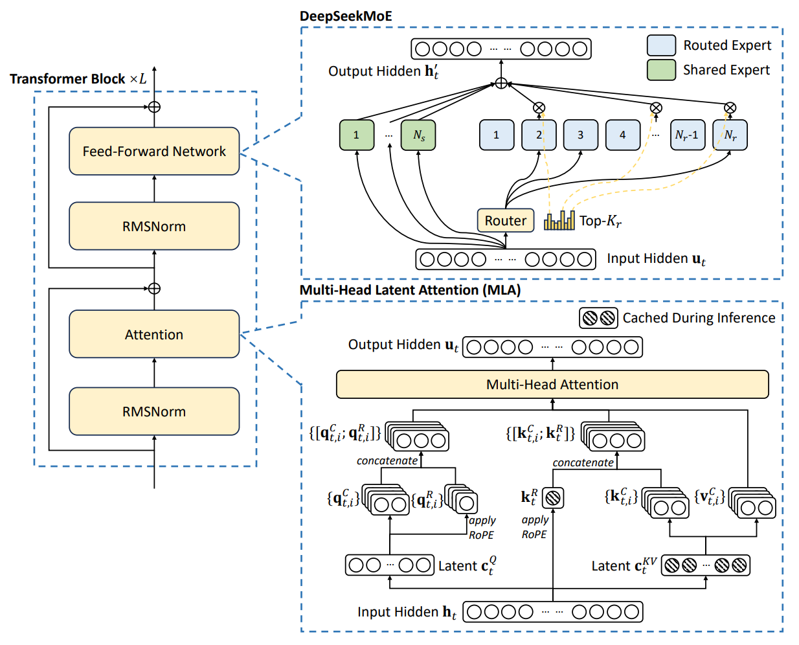

## 1. 模型结构（Model）

DeepSeek‑V3 在经典 Transformer 干线上引入两大关键模块：用于降低 KV cache 与激活开销的 MLA，以及用于扩大“总容量、保持计算稀疏”的 DeepSeekMoE。总体目标是在同等算力预算下实现更强的可扩展性与更低的推理成本。

### 1.1 Multi‑Head Latent Attention（MLA）

**核心思想：** 对注意力中的$K,V$先做联合低秩压缩，仅缓存小维度潜变量，再在需要时上投影重构；对$Q$也做低秩压缩以降低激活内存。位置编码采用 RoPE，并在$K$的一部分维度上“解耦”为位置分量，使 RoPE 仅作用到被指定的子维上。

+ 设每头维度为$d_h$，将输入隐藏态$h_t$投影为紧凑潜变量$c_t^{KV}\in\mathbb R^{d_c}$，随后通过上投影得到$K,V$；$Q$类似压缩到$d_c^{q}$再上投影得到计算用的查询。
+ 在$K$的构造中，将潜变量分为内容分量与位置分量，后者施加 RoPE 旋转后再与内容拼接，得到最终$K$。推理时仅需缓存$c_t^{KV}$与小维度的位置分量，显著降低 KV cache。
+ 注意力仍按$A(Q,K,V)=\mathrm{softmax}(QK^\top/\sqrt{d}),V$计算，但$Q,K,V$来自上述压缩/解耦流程。

**经验设定（示例）：**$n_h=128$、$d_h=128$、$d_c=512$、$d_c^{q}=1536$，解耦位置子维约每头$64$。这些设定在长上下文与内存占用间取得良好平衡。

### 1.2 DeepSeekMoE（包含共享专家与路由专家）
**结构要点：**

+ 自第 4 层起，FFN 基本被 MoE 取代。每层包含$1$个**共享专家**（所有 token 始终激活）与$256$个**路由专家**（按路由选择）。
+ 每个 token 选择 Top‑K 个路由专家（如$K=8$），与共享专家共同参与计算，输出为加权和：

$$h'_t = f_{\text{shared}}(u_t) + \sum_{r \in \mathcal S_t} G_{t,r}\, g_r(u_t)$$

  其中$f_{\text{shared}}$为共享专家，$g_r$为被选路由专家，$G_{t,r}$为门控权重。

>$G_{t,r}$门控权重的计算方式为：
>
> 1. **计算路由 logits：**
>
>$$z_{t,r} = (W_{\text{router}} u_t)_r + b_r$$
>
> 其中$W_{\text{router}}$是路由器的权重矩阵，$b_r$是对应专家的偏置项。
>
> 2. **选择 top-k 专家：**  
对$z_{t,r}$进行排序，取前8个最大的专家作为候选（DeepSeek-V3 里是 8 个路由专家 + 1 个共享专家）。
> 3. **归一化得到门控权重：**
>
>$$G_{t,r} = \frac{\exp(z_{t,r})}{\sum_{r' \in \mathcal{S}_t}\exp(z_{t,r'})}, \quad r \in \mathcal{S}_t$$
>
> 这里$\mathcal{S}_t$表示 token$t$激活的专家集合，未被选中的专家权重直接置为 0。
>

专家内部多采用轻量的 SwiGLU 前馈结构（中间维相对密集 FFN 明显缩小），提升单位显存下的专家并行度。

**直观理解：** 共享专家提供稳健的“通用能力底座”，路由专家承载“细粒度领域专长”；两者叠加使单位计算的“有效容量”得到显著提升。

### 1.3 负载均衡：Aux‑loss‑free 与节点限制路由
**Aux‑loss‑free 负载均衡：** 不再通过额外的辅助损失控制专家使用频率，而是为每个专家维护一个**可学习偏置**$b_r$用于路由打分的“温和干预”：

+ 训练时统计每步各专家负载，若某专家负载高于期望，则小幅降低其偏置；反之提高。偏置仅影响**是否被选中**，不影响门控值计算。
+ 这样做避免辅助损失权重调不当对主任务表示学习的负面影响，实践显示更稳定。

**序列级极小正则：** 为避免单个长序列极端倾斜，额外加入一个非常小权重的序列均衡项作为兜底。

**节点限制路由：****训练中采用专家并行（EP）跨节点放置。为降低跨节点 all‑to‑all 通信，将每个 token 的可用专家限制在****最多 4 个节点**内搜索与派送，在几乎不损性能的情况下大幅降低通信压力。

**零 token‑dropping：** 在上述均衡与限制策略配合下，训练全程无需丢弃 token。

### 1.4 归一化、激活、位置编码与分词器
+ **归一化与激活：** 采用 RMSNorm 与 SwiGLU，前者在大模型与低精条件下更稳定，后者可提升前馈表达力与梯度流动性。
+ **位置编码：** RoPE 并配合 MLA 的位置分量“解耦”设计，方便后续基于 YaRN 的上下文扩展。
+ **分词器：** 自研 byte‑level BPE，词表约 128K；为压缩多语与代码文本，引入“标点+换行”复合 token，同时在训练中对部分复合 token 随机拆分以缓解边界偏置。

## 2. 训练数据（Data）
### 2.1 规模与构成

+ 总规模约 14.8T token，显著高于此前多数开放模型。
+ 英文与中文为主，同时扩大多语种覆盖，显著提高数学与代码等“高推理密度”语料占比，以提升复杂推理能力。

### 2.2 清洗与去重
+ 多阶段去重（近似重复、段落级相似）、低质过滤（噪声、过短、广告等）、格式统一，强调在去重同时**保多样性**，避免出现领域与风格收缩。

### 2.3 文档打包与填充策略
+ 训练样本采用“文档打包”以减少 padding 浪费，提升吞吐：将若干短文档拼接为接近最大长度的序列喂给模型。
+ 报告策略中不对跨文档注意力做专门屏蔽，权衡了效率与一致性。

### 2.4 FIM 中间填空
+ 以约 10% 的概率采用 FIM 模式（Prefix‑Suffix‑Middle，PSM 模板），训练模型利用双向上下文填补中段，特别有利于代码与结构化文本处理。

### 2.5 分词器与边界偏置缓解
+ 大词表有利于多语与代码压缩，但“标点+换行”复合 token 会在多行提示中引入边界偏置。
+ 训练时随机拆分部分复合 token，使模型见过“合并”和“拆开”两种情况，从而显著缓解该偏置。

## 3. 预训练（Pre‑training）
### 3.1 训练目标：CLM 与 MTP
DeepSeek-V3的预训练以标准的**自回归语言模型目标**为主，即让模型预测序列中的下一个token。损失函数为因果语言模型的交叉熵损失$L_{\text{LM}}$。与多数Transformer LM类似，模型基座通过最小化$L_{\text{LM}} = -\frac{1}{N}\sum_{t}\log P(x_t,|,x_{<t})$来学习。**额外地**，DeepSeek-V3引入了**多Token预测 (Multi-Token Prediction, MTP)** 的辅助训练目标。不同于传统只预测下一个词元，MTP鼓励模型在每个位置上**展望多个未来词**，目的是**增加训练信号密度，提升训练效率**。具体实现为：对于每个输入token，额外附加一个“小型Transformer模块”去预测其之后第2个token。DeepSeek-V3设置MTP深度为1，即每个位置除预测下一token外，再预测下下个token共两个位置。为了不干扰主模型，MTP模块**共享**了主模型的embedding层和输出softmax层，只是在中间增加一个Transformer层形成预测深度链。预测流程是顺序的：先用主模型预测$t+1$位置，再将该预测隐藏态和原embedding拼接输入下一个模块预测$t+2$，以此保持完整的因果链。每个深度都有自己的交叉熵损失$L_d$。最终MTP总损失是所有深度损失的平均并乘以一个权重系数$\lambda$。

+ **主目标：** 标准因果语言建模（CLM）交叉熵，最小化$-\sum_t \log p(x_t\mid x_{<t})$。
+ **辅助目标：Multi‑Token Prediction（MTP）**  
在每个位置额外预测未来第$k$个 token（本报告设置$D=1$，即额外预测第 2 个 token），提升训练信号密度与“向前规划”的表征能力。总损失示意：

$$L = L_{\text{CLM}} + \lambda \cdot \frac{1}{D}\sum_{k=1}^{D} L_{\text{MTP}}^{(k)}$$

训练前期采用较大$\lambda$（如 0.3）以放大辅助信号，后期降至 0.1 以回归主目标；推理阶段可直接丢弃 MTP 模块，或用作推测解码草稿头以提速。

### 3.2 模型与训练配置
+ **总参数规模：** 约 671B（含全部专家），但因 MoE 稀疏路由，**单 token 激活参数约 37B**，推理成本近似一个 37B 密集模型。
+ **序列长度：** 预训练阶段最大全长 4K（长上下文在后续阶段扩展）。
+ **优化器与裁剪：** AdamW，常见设定如$\beta_1=0.9,\ \beta_2=0.95,\ \mathrm{wd}=0.1$，梯度裁剪范数 1.0。

### 3.3 学习率与批大小调度
+ **学习率调度（示例）：** 约 2K 步线性 warmup 至峰值学习率，随后在极长阶段保持常数，接着做余弦衰减；末段采用逐段较小常数 LR 精修收敛。
+ **批大小调度：** 全局批从约 3072 平滑增长至 15360（在若干亿 token 内逐步增大），随后保持稳定，以兼顾前期稳健收敛与后期高效吞吐。

### 3.4 长上下文扩展（YaRN，至 128K）
+ 预训练完成后，分两阶段进行 RoPE 频率重标定的上下文扩展微调：4K→32K→128K。
+ 每阶段训练约 1000 步，使用与预训练末期相当的小学习率；在 Needle‑in‑a‑Haystack 等基准上展现稳定的长程检索与定位能力。

### 3.5 训练稳定性与成本
+ 训练过程报告为全程稳定，无不可恢复的 loss spike 与 checkpoint 回滚。
+ 计算规模：2048×H800 集群，整体 GPU‑hours 量级约 2.788M（含预训练、上下文扩展与后训练），在该规模模型中具备极高的性价比。

## 4. 后训练与对齐（Post‑training & Alignment）
### 4.1 有监督指令微调（SFT）

+ **数据规模与覆盖：** 约 150 万条指令样本，覆盖数学、代码、常识推理、开放 QA、写作与多轮对话等。
+ **构造方式：**  
复杂推理样本由更强推理模型生成初稿，再经专家模型与规则校正、拒绝采样筛选，保留“正确、清晰、简洁”的风格；非推理样本由上一代对话模型生成并经人工审核修订。
+ **训练要点：** 2 个 epoch 左右、余弦退火小 LR；使用样本打包与**可见性掩码**保证同一序列内不同样本互不可见。

### 4.2 人类反馈强化学习（RLHF，GRPO）
+ **奖励模型（RM）：**  
规则式 RM 用于可客观判定任务（数学答案格式校验、代码编译与单测通过率）；模型式 RM 用于开放任务，偏好数据可包含评审 CoT，以提升鲁棒性。
+ **优化算法：GRPO**  
组内相对优势作为基线，免价值网络：对同一提示采样多份回答，计算评分均值或分位数作为基线$B$，每个回答的优势为$A=R-B$，最大化期望的$\frac{\pi_\theta(x)}{\pi_{\text{old}}(x)}A$，并对参考策略加 KL 正则限制策略漂移。
+ **提示池：**覆盖代码、数学、开放问答、角色扮演与多轮对话等，强化多域对齐与稳健性。

## 5. 基础设施与工程优化（Infrastructure）
### 5.1 集群与总体并行策略
+ **硬件：** 2048×NVIDIA H800；节点内 NVLink/NVSwitch，跨节点 InfiniBand。
+ **并行：** 典型为 16‑way Pipeline Parallel（PP）× 64‑way Expert Parallel（EP）× 少量 Data Parallel（DP，ZeRO‑1 分摊优化器状态）。**不使用 TP**，用工程优化抵消其带来的通信复杂度。

### 5.2 DualPipe：通信与计算的深度重叠
+ 将前向与反向传播拆分为更细粒度的计算与 all‑to‑all 子块，重新编排使 dispatch/combine 与 Attention/MLP 交错执行，前后向在管线两端相向填充，最大化通信隐藏。
+ 显式控制通信核与计算核占用 SM 的比例，减少管道气泡与“空等”。

### 5.3 高效 all‑to‑all 与显存优化
+ **两段式路由：** 先 IB 发送到目标节点的“同编号 GPU”，再经 NVLink 快速内转至专家 GPU，IB 与 NVLink 两路传输可并行推进。
+ **warp specialization：** 为 IB 发送、NVLink 转发、接收与累加等任务分设专用 warp 通道，在较少 SM 占用下“跑满”链路带宽。
+ **显存优化：**  
激活重计算（如 RMSNorm 与 MLA 上投影输出）、EMA 参数放置 CPU 侧异步更新、MTP 与主干共享嵌入与输出头，优化器状态以 BF16 存储等。

### 5.4 FP8 混合精度训练的关键细节
**三路 GEMM FP8 化：** 前向、反向激活梯度与反向权重梯度的主矩阵乘在 FP8 执行；嵌入、归一化、注意力 softmax、路由器与输出头等关键部分保留高精度；主权重与优化器主状态以 BF16/FP32 存储。

+ **细粒度量化：** 激活按 1×128 通道 tile、权重按 128×128 block 各自独立缩放，抗异常值、扩展有效动态范围；普遍采用 E4M3（尾数优先）以提高数值精度。
+ **提高乘加累加精度：** 观察到原生 FP8 Tensor Core 累加有效位有限，采用“阶段性晋升到 CUDA Core FP32 寄存器累加后回写”的混合累加路径，在极低开销下显著降低累计误差。
+ **低精通信：** MoE 的 dispatch/combine 通道对激活与梯度做 FP8 量化传输，关键汇聚点保持 BF16 累加，兼顾带宽与精度。

### 5.5 推理部署：Prefill 与 Decode
+ **Prefill（高吞吐）：** 最小 4 节点 32 卡单元；注意力 TP4+SP，MoE EP32，DP8 复用；为缓解热点专家，在线统计后**冗余部署**高负载专家的副本；采用双 micro‑batch 交错隐藏 all‑to‑all 与 TP 通信。
+ **Decode（低时延）：** 最小 40 节点 320 卡单元；注意力 TP4+SP，MoE EP320，DP80；跨节点 all‑to‑all 走 IBGDA 点对点直连；同样可基于统计做冗余专家，降低尾部时延。

## 6. 超参配置速查
**模型与注意力**

+ 层数约 61，隐藏维 7168；多头数 128，每头维 128
+ MLA：$d_c=512$，$d_c^{q}=1536$；解耦位置子维每头约 64
+ RoPE 位置编码，配合 YaRN 长上下文扩展（4K→32K→128K）

**MoE 与路由**

+ 每层 1 共享专家 + 256 路由专家；Top‑$K=8$
+ 节点限制路由：每 token 参与节点数不超过 4
+ 负载均衡：Aux‑loss‑free（专家偏置），序列级极小正则
+ Token‑dropping：无

**数据与预处理**

+ 14.8T token，多语种，数学与代码占比提升
+ 文档打包，不做跨样本注意力屏蔽
+ FIM 采样率约 0.1；byte‑level BPE 词表约 128K
+ 复合 token 随机拆分缓解边界偏置

**优化与调度**

+ AdamW，$\beta_1=0.9,\ \beta_2=0.95,\ \mathrm{wd}=0.1$；裁剪范数 1.0
+ 序列长 4K（预训练）；长上下文扩展到 128K
+ 学习率：2K 步 warmup → 长期常数 → 余弦衰减 → 末段小常数精修
+ 批大小：3072 → 15360（逐步增大后保持）
+ MTP：$D=1$，前期$\lambda\approx0.3$，后期降至 0.1

**并行与基础设施**

+ 2048×H800；PP×EP×DP（不使用 TP）
+ DualPipe 重叠通信与计算；IB+NVLink 分层路由
+ FP8 训练：E4M3、tile/block 量化、阶段性 FP32 累加
+ 推理：Prefill 32 卡单元，Decode 320 卡单元；冗余专家缓解热点

