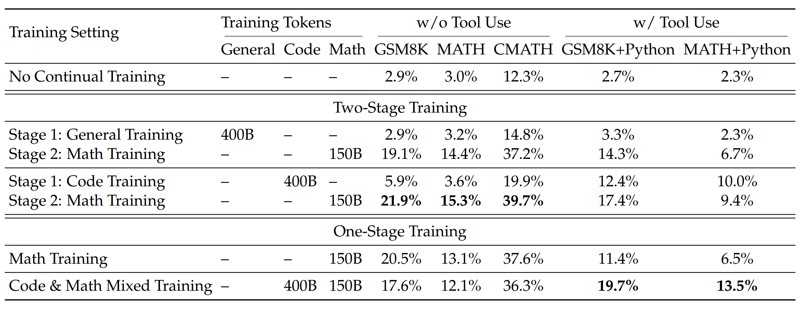
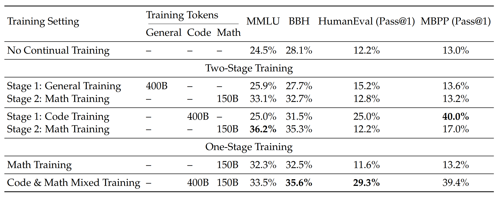

## 0. 引言
+ **定位**：DeepSeekMath 是在代码基座上继续预训练的大规模数学模型，随后用指令微调与轻量强化学习进一步打磨。
+ **关键抓手**：
    1. **数据侧**：用可迭代的网页挖掘与清洗流水线，构造约百亿量级的数学 token 继续预训练；
    2. **训练侧**：在不引入价值网络的前提下，用 **GRPO** 进行强化学习，使策略分布更稳定。
+ **结果**：7B 量级模型在 GSM8K 与 MATH 等基准上取得强竞争力，在不开外部工具的设置下，报告显示 MATH Top-1 超过 50%，自一致性少样本采样进一步上升。

## 1. 为什么先从数据工程说起
多数“数学推理”工作的分水岭，不在“模型是否更深奥”，而在**数据是否更对路**。DeepSeekMath 的一个直接经验是：

+ 从**代码模型**起步（更强的符号与语法感知），
+ 用**大规模网页数学文本**做继续预训练（远大于常见教材与论文体量），
+ 再用**结构良好的指令数据**做 SFT，
+ 最后用**不那么重的 RL** 做抛光。

这条路线最大化利用了“数据分布与推理任务的一致性”，训练侧避免了“昂贵而脆弱的价值网络”，让小模型也能显出“稳定和复现”的质感。

## 2. DeepSeekMath 项目脉络
+ **基座**：以代码模型为起点的 7B。
+ **继续预训练**：以网页数学语料为主，规模约百亿 token 级。
+ **SFT**：约 70 多万条中英数学指令数据，覆盖 CoT、PoT、工具增强等格式。
+ **RL**：采用 **GRPO**（Group Relative Policy Optimization），通过组内相对奖励估计优势，不再训练价值网络；在损失项里直接加入与参考策略的 KL 正则。

## 3. 数据处理 pipeline
下面这条流水线不是“唯一正确”，但它解释了 DeepSeekMath 在“规模、纯度、结构化程度”上的做法，且便于复用到其他专业领域。

### 3.1 端到端视图
#### 3.1.1. 候选发现
+ 用关键词、正则与轻量分类器（如 fastText）在 Common Crawl 这类大库里做初筛，给每个页面一个“数学相关度”打分。
+ 以“样本高分页面的域名、目录模式”为线索，做**域级与路径级扩张**，比如持续抓取 `math.*`、`/problem/`、`/solution/` 一类高产路径。
#### 3.1.2. 迭代回采
+ 统计正例集中出现频率高的域名和 URL 模式，建立“可靠源清单”。
+ 基于“域名得分 + 路径模板得分 + 页面得分”做加权回采，形成“数据-模式-回采”的**闭环**。
#### 3.1.3. 内容抽取与结构化
+ HTML 去模板、去导航、去广告，保留正文与代码块；
+ 识别题目、步骤、结论等结构片段，尽量抽取“题面-推理-答案”三段式；
+ 识别公式块与行内公式，将其与上下文绑定，避免丢失语义邻域。
#### 3.1.4. 清洗与去污
+ 语言筛选（优先中英），长度与稠密度阈值过滤；
+ URL 归一化与去跟踪参数，精确去重（hash）与近重复去重（SimHash 或 MinHash）；
+ 对基准集做 n-gram 层面的**泄漏去重**（如与 GSM8K、MATH 等形成黑名单 n-gram），防止训练-评测穿模。
#### 3.1.5. 质量评估与抽样
+ 训练轻量质量分类器，特征包含：数学密度、代码密度、困惑度、结构完整性等；
+ 分位抽样，保证不同来源、不同子领域都能被覆盖；
+ 对噪声较多的子域（例如几何与图形）单独加权补齐。
#### 3.1.6. 数据混合策略
+ 继续预训练阶段维持一个**多元混合**：数学网页为主，配比加入代码、学术论文、自然语言泛化文本等，以减缓“能力遗忘”；
+ 指令阶段统一格式（见 3.3），兼顾 CoT、PoT 与工具格式，形成面向推理的高信度标注集。
#### 3.1.7. 标注一致化与审计
+ 统一标注模板，保证“题面-推理-答案”的列对齐；
+ 对易错题型设立审计样本池，训练中周期性抽检，形成“数据-训练-评测-返修”的闭环。

### 3.2 两个关键子模块
**A. 数学性判别器（Mathness Scorer）**

+ 输入特征：公式密度、数学术语词表匹配、代码与数字占比、句法复杂度、困惑度分段等。
+ 目标：把“教程类”“题解类”“学术类”“论坛问答”等高价值页面打到高分，把“目录页”“聚合页”“广告页”打到低分。
+ 用途：排序与阈值，指导回采与抽样。

**B. 近重复去重（Near-Dup）**

+ URL 层面：归一化去参；
+ 文本层面：文段级分块，句子级去重，SimHash 或 MinHash 检测 80% 以上相似度的近重复；
+ 评测泄漏守门：维持一个“评测 n-gram 黑名单”，训练集中若出现这些 n-gram 序列，直接剔除或替换。

### 3.3 指令数据的统一格式
建议在 SFT 阶段统一到如下三段式模板，便于后续 RL 与评测：

```json
{
  "question": "题面（可含必要上下文与约束）",
  "reasoning": "逐步推理过程（CoT 或 PoT：可包含运行日志或中间变量）",
  "answer": "最终答案（严格对齐评测口径）",
  "meta": { "lang": "zh|en", "domain": "algebra|geometry|number_theory|..." }
}
```

+ CoT：偏文字推演；
+ PoT：偏程序化推导（例如 Python 小段落），注意把“计算过程”与“口径一致的最终答案”明确区分；
+ 工具格式：再加一个 `tool_calls` 字段，记录允许外部工具时的调用序列与返回值。


## 4. 训练工艺：从继续预训练到 SFT
+ **继续预训练**
    - 数据以数学网页为主，穿插一定比例代码、论文与通用文本；
    - 目标是把“数学语义、符号习惯、题解文体”内化到基座里；
    - 训练曲线关注困惑度、字表覆盖度、公式还原率、结构稳定性等指标。
+ **SFT**
    - 用统一格式的指令数据做监督微调；
    - 混合 CoT 与 PoT，PoT 关注“稳态可执行推导”，CoT 关注“可读与可审计的逻辑链”；
    - 对齐评测口径：保证 `answer` 字段与基准评测的判分规则完全一致（大小写、空格、单位、分数与小数等）。

## 5. GRPO：轻量但有效的强化学习
**动机**：PPO 虽然常用，但价值网络既吃显存又容易不稳，尤其在“奖励只在结尾给分”的数学任务上，token 级价值学习很难。  
**GRPO 的取舍**：

+ 不训练价值网络，直接在**同题多解的组内**做相对比较，以组内均值作为基线，构造优势；
+ KL 正则直接放到损失项里，约束新旧策略的偏移幅度；
+ 仍保持 PPO 的裁剪结构，让更新不过猛。

**一步到位的训练框**：

1. 旧策略对同一题目采样 G 条候选；
2. 用自动判分、格式校验或弱标签对候选给分；
3. 计算组内相对奖励，得到每个 token 的优势估计；
4. 新策略做裁剪后的策略梯度更新，同时加上对参考策略的 KL 正则；
5. 监控两个指标：
    - **Pass@K**（至少一条正确）
    - **Maj@K**（多数表决正确）  
经验证，RL 更明显改善 **Maj@K**，说明“正确解”从小概率尾部被挪到了主模态。

**超参提示**：

+ 组大小 G 建议中等（例如 4 到 8），过小方差大，过大会拖慢；
+ KL 系数从小到中，配合温度与长度惩罚调优；
+ 对“有明确答案”的题目更稳，对“开放式”或“几何绘图”类要小心噪声奖励。

---

## 6. 实验结果
### 6.1 数据流水线带来了什么
#### 6.1.1 语料对比：DeepSeekMath Corpus vs 其他数学语料（1.3B模型，few-shot CoT）
| 语料 | 规模 | GSM8K | MATH | MMLU STEM | CMATH |
| --- | ---: | ---: | ---: | ---: | ---: |
| 无数学训练 | N A | 2.9 | 3.0 | 19.5 | 12.3 |
| MathPile | 8.9B | 2.7 | 3.3 | 15.7 | 1.2 |
| Proof-Pile-2 | 51.9B | 14.3 | 11.2 | 29.2 | 19.9 |
| **DeepSeekMath Corpus** | **120.2B** | **23.8** | **13.6** | **33.1** | **41.5** |


可以看到，仅靠更好的网页数学语料，1.3B模型在GSM8K和CMATH上大幅领先同类语料，同时在MATH与MMLU STEM上也更稳。更重要的是，学习曲线随token持续上升，未过早“平台化”。

#### 6.1.2 抓取与去污的关键动作
+ fastText召回高分页面，按域与路径模式迭代回采，四轮后得到约35.5M页面、120B token；对评测集做n-gram去污染。
+ 直接结论：网页挖掘是数学文本的“富矿”，规模与质量上均优于小体量的纯学术语料；后文也将看到，**单用arXiv并不理想**。

### 6.2 继续预训练：代码基座 + 混合配比的收益
**7B Base与同类基座对比（few-shot CoT，不开工具）**

| 模型 | 尺寸 | GSM8K | MATH | SAT | MMLU STEM | CMATH |
| --- | ---: | ---: | ---: | ---: | ---: | ---: |
| Mistral | 7B | 40.3 | 14.3 | 71.9 | 51.1 | 44.9 |
| Llemma | 34B | 54.0 | 25.3 | 71.9 | 52.9 | 56.1 |
| Minerva | 540B | 58.8 | 33.6 | 63.9 |  |  |
| **DeepSeekMath-Base** | **7B** | **64.2** | **36.2** | **84.4** | **56.5** | **71.7** |


同为开源基座，DeepSeekMath-Base 7B在所有基准上都处于第一梯队，尤其MATH 36.2%显著超过同尺寸与更大尺寸的开源基座，接近Minerva大模型段位。其数据配比里**仍保留20%代码与10%通用文本**，有助于稳住通用能力。

### 6.3 指令微调：把“题面-推理-答案”统一起来
+ 约776K条中英数学指令，覆盖CoT、PoT与工具集成格式。以该数据在Base上做SFT，得到的Instruct 7B在不开工具时：GSM8K 82.9%，MATH 46.8%；允许工具时，MATH+Python 57.4%。

### 6.4 GRPO强化学习：小改造，实打实的增益
**从Instruct到RL的增量**

| 模型 | GSM8K | MATH | MGSM-zh | CMATH |
| --- | ---: | ---: | ---: | ---: |
| DeepSeekMath-Instruct 7B | 82.9 | 46.8 | 73.2 | 84.6 |
| **DeepSeekMath-RL 7B** | **88.2** | **51.7** | **79.6** | **88.8** |


允许工具时：GSM8K+Python从83.7%到86.7%，MATH+Python从57.4%到58.8%，中文两项也同步抬升。


RL前后对比显示，**Maj@K显著提升，而Pass@K近似持平**。这说明RL让正确解从“尾部小概率”迁移到“主模态”，减少采样数也能稳定拿到对。对工程落地，这等价于**更省采样、更好复现**。


### 6.5 代码训练为什么要保留：程序辅助推理和通用能力都受益
#### 6.5.1 两阶段与一阶段的实测（1.3B）


先做代码再做数学，**PoT类任务的能力更强**，且二阶段后的整体表现更好。代码数据混合训练，对于工具使用效果更佳。

#### 6.5.2 代码与数学混合的一阶段训练还能守住编程能力（1.3B）


混合一阶段不但保持了推理与通用能力，还显著提高HumanEval和MBPP，缓解二阶段后的“灾难性遗忘”。对实务来说，这样的配比能让系统在**数学与代码双轨任务**上更稳。


### 6.6 关于arXiv：在本项设置下收益不明显
+ 在1.3B与7B上做过多组对比，**仅用arXiv系语料**进行数学训练，对GSM8K、MATH、MMLU STEM乃至miniF2F并无收益，甚至会退化。下表节选两组结果：
    - 7B基座数学训练于MathPile或ArXiv-RedPajama后，GSM8K和MATH均低于无数学训练的同尺寸基座某些项；
    - miniF2F上，arXiv训练后的valid与test也显著低于无数学训练。

> 注：作者也强调这一结论有范围条件，未来还需在更大模型或更细分任务上再次验证。
>


### 6.7 模块作用与数据支撑小结
+ **网页数学语料**：把1.3B从GSM8K 14.3%左右提升到23.8%，CMATH从19.9%到41.5%，并延缓“平台期”。这证明迭代抓取与去污确实在质量与规模上更优。
+ **代码初始化与保留**：7B Base在MATH 36.2%且MMLU STEM 56.5%，说明代码分布对数学与通用推理都有正向作用；在1.3B上，代码→数学的两阶段和代码+数学混合均能提升PoT与编程类基准。
+ **SFT统一格式**：Instruct 7B不开工具已到MATH 46.8%，为RL提供了稳定起点。
+ **GRPO强化学习**：在不引入价值网络的前提下，把MATH再抬5个点到51.7%，且GSM8K到88.2%；核心收益是让“正确解”更集中，Maj@K显著上升。
+ **剔除潜在无效数据源**：在本设置下，单用arXiv难以提升数学推理，资源更应倾斜到网页挖掘与高质结构化题解。

**实施建议**

1. **先把数学网页“挖干净”**：做一个领域判别器先跑通闭环；从域名和路径模板扩张；严格n-gram去污染。
2. **保留代码与通用文本的占比**：继续预训练阶段维持混合，避免数学强化后通用与编程能力塌陷。
3. **SFT统一模板，口径一致**：题面-推理-答案的三段式有利于后续RL与评测。
4. **RL优先用GRPO**：组大小4到8，温和KL，先看Maj@K曲线是否上扬；必要时做两轮迭代RL。


## 7. 总结与思考
DeepSeekMath 是一套完整的“工学方法论”：

+ 用**迭代式数据挖掘**把“数学文本的真实分布”搬进模型；
    - 先做一个“领域相关度”判别器，尽快让抓取闭环跑起来；
    - 极度重视去重与泄漏守门，优先构建评测 n-gram 黑名单；
    - 对薄弱子域（如几何）单独补齐来源和标注；
    - 混合保留一部分代码和通用文本，防止能力塌陷。
+ 用**统一的指令格式**提升可训练性与可评测性；
    - 继续预训练阶段关注“结构稳定性”与“公式还原”，多做灰度评估；
    - SFT 统一模板，严格对齐评测口径；
+ 用**轻量 RL** 做最后的分布修正，让正确解更“可复现”。
    - RL 起步用 GRPO，G 取 4 到 8，KL 从小到中递增，重点盯 Maj@K 与解的多样性。
+ 除了标准分数，务必看两件事：
    - 正确解是否集中在少量模式（多样性下降的风险）；
    - 错误是否集中在某些子域（面向数据回补与训练再平衡）。

这四个抓手在其他领域依然成立：先把数据分布找对，再把训练工艺走顺，然后用小而稳的 RL 优化，最后评价回溯。


**参考**

+ DeepSeekMath: Pushing the Limits of Mathematical Reasoning in Open Language Models, arXiv:2402.03300

