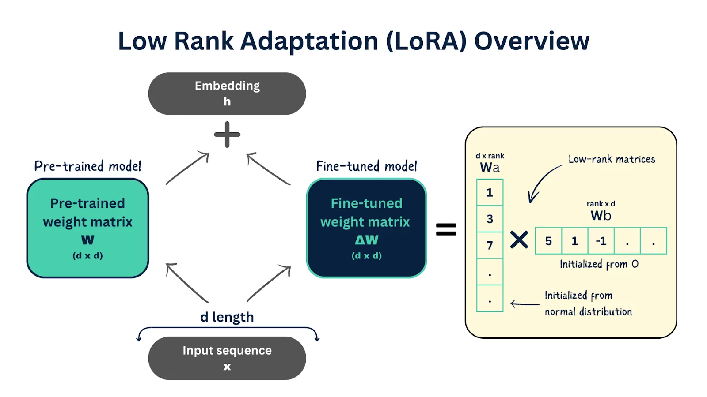
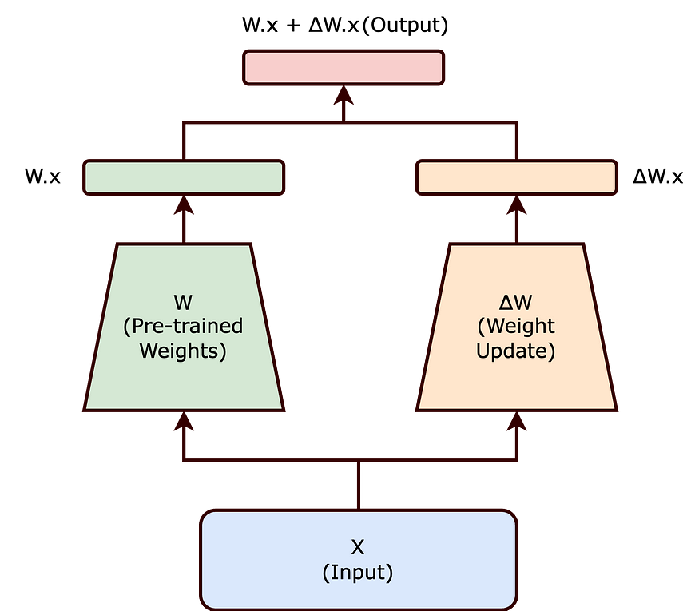

## LoRA是什么
**LoRA（Low-Rank Adaptation）****是一种****参数高效**的模型微调技术，用于在不大幅增加参数数量的前提下适配大型预训练模型。其核心思想是：在微调阶段**冻结预训练模型的大部分权重**，仅在每层添加**可训练的低秩矩阵**来表示模型参数需要调整的部分，从而实现对模型的高效适应。这种方法的提出背景是在大型语言模型（LLM）不断扩大的情况下，传统的全参数微调变得愈发不可行。LoRA由微软研究院的团队于2021年提出，是当时一系列**参数高效微调（PEFT）****方法之一，与2019年的Adapter插入、斯坦福的Prefix Tuning、谷歌的Prompt Tuning、清华的P-tuning v2等方法齐名。相较而言，LoRA在各种基准任务上往往取得更优的效果，并克服了其他方法的一些缺点：例如Adapter会增加模型层数从而引入****推理延迟**，Prefix-Tuning需要占用部分输入序列空间且难训练，P-Tuning v2则易引发旧知识遗忘等问题。LoRA通过低秩矩阵微调避免了这些问题，在保持模型性能的同时不引入额外的推理开销。

LoRA名称中的“低秩”指的是矩阵的秩这一概念。LoRA假设大型模型在迁移到特定任务或领域时，其**权重更新在内在维度上是低秩的**。也就是说，模型需要调整的参数变化可以被压缩到远低于原始维度的子空间中，而不显著损失模型表达能力。基于这一假设，LoRA不直接调整原模型庞大的权重矩阵，而是学习一个低秩的近似更新。本质上，LoRA提出在不改变原模型架构的前提下，用很小的额外参数实现与全参数微调相当的效果。例如，LoRA在RoBERTa、DeBERTa、GPT-2、GPT-3等模型上的实验表明，只需训练不到原模型万分之一的参数量，性能就能与全量微调相当，部分任务上甚至更优。LoRA方法的有效性也证明了大型语言模型在适配新任务时的梯度更新确实可能具有**低秩结构**，这一发现为理解大型模型的可微调性提供了新的视角。

## 为什么要有LoRA
**大型语言模型的微调难题。** 随着Transformer架构的流行和模型规模的爆炸式增长，现代LLM（如GPT-3、PaLM等）常动辄上百亿甚至千亿参数。这给模型的**微调（fine-tuning）****带来了巨大的挑战。传统微调需要对模型的所有参数基于新数据进行梯度更新，这在小模型上问题不大，但对超大模型而言几乎不可承受。以OpenAI GPT-3 (1750亿参数)为例，如果我们想让它适应一个新领域或任务，完整微调就意味着对****1750亿**参数重新训练，并部署一套新的模型权重。这不但训练开销巨大，而且每增加一个细分领域都要存储一份175B大小的模型副本，**存储和维护成本极其高昂**。因此，在模型越来越大的今天，科研人员和工程师迫切需要一种**更高效的微调方法**，既能降低计算/存储成本，又能避免每次任务都训练和保存整套大模型。

**LoRA解决的核心痛点。** LoRA正是为了解决上述痛点而提出。它通过极大地减少需要训练的参数数量，使微调大型模型变得切实可行。具体而言，LoRA采用低秩分解技巧，将微调所需的参数更新限制在由两个小矩阵生成的子空间中，而无需更新原模型全部参数。这带来了显著的效率提升：例如，使用LoRA微调GPT-3时，**可训练参数从1750亿降低到仅约1800万**，减少了**将近10,000倍**，同时GPU显存需求降低约2/3（约减少3倍）。换言之，只需不到原模型0.1%的参数，就能实现同样的适应效果。这大幅降低了微调所需的计算资源和内存占用，使得在单张GPU上微调数十亿参数模型成为可能。更重要的是，LoRA微调后的模型在性能上仍能**媲美甚至优于**全参数微调。正如LoRA原论文所报道的，在RoBERTa、GPT-2等模型上LoRA微调达到了与全微调相当的精度，而训练开销却要小几个数量级。

另一个LoRA的重要优势是**模块化适配**能力强，解决了多任务部署的存储难题。以往如果一个基础模型需要适应多个下游任务，往往不得不保存多份完整的微调后模型（每个任务一份），这对存储和版本管理非常不友好。而LoRA只需保存每个任务对应的那组小型低秩矩阵（通常仅有几十MB），所有任务可以**共享同一个冻结的基础大模型**。在部署时，只需将不同任务的LoRA模块动态加载到基座模型中，即可在各任务间快速切换，而无需加载多个庞大的模型文件。这种“**一模多用**”的能力极大提高了大型模型在工业场景下的实用性：例如，一个7B参数的基础模型可以配合成千上万个不同任务的LoRA权重，实现**多租户**的大模型服务，每个用户请求调用不同的LoRA适配器，但共享相同的底层模型，从而显著摊薄部署成本。

简而言之，LoRA之所以诞生，是为了让**大型模型的微调变得高效、廉价且易管理**。它成功解决了以往存在的关键瓶颈：**训练开销过大**（通过减少训练参数数量解决）、**显存占用过高**（通过冻结大部分权重解决）、**多任务存储冗余**（通过模块化的小型权重解决）。这些优势使LoRA成为近年来适配大模型最具影响力的技术之一，也为资源受限的研究者和工程师打开了利用LLM的方便之门。

## LoRA是如何工作的

_图1：常规微调（左）需要对完整权重矩阵$W$_应用梯度更新$\Delta W$_，而LoRA 方法（右）假设$\Delta W$_可以用两个低秩矩阵的乘积来近似表示（$\Delta W \approx A \times B$_）。LoRA在训练中直接学习这样的低秩分解，从而仅需更新$A$_和$B$_两个小矩阵即可完成模型适应。_

> **矩阵秩**是矩阵列（或行）向量组的最大线性无关数目，反映了该矩阵可表示信息的“维度”  
>

LoRA的核心机制是在Transformer等模型的每一层**引入并行的低秩权重调整分支**，并将其输出与原层的输出相加，从而完成对原模型的细微调整。具体来说，对于原模型中的一组权重矩阵$W$（形状为$[H_1, H_2]$） ，LoRA会新增两个可训练矩阵： $A$和$B$（形状$[r, H_2]$） 其中$r$是远小于$H_1, H_2$的预设低秩（通常在8～32左右）  。 在微调过程中，我们冻结原权重$W$不变  ，仅训练$A$和$B$的参数使之逼近所需的权重更新。推理时，LoRA将模型权重调整为$W_{\text{new}} = W + \Delta W = W + A \times B$。由于$A \times B$实际上是一个秩为$r$的矩阵近似$\Delta W$，它包含了模型为适应新任务所需的那部分变化，而无需直接存储完整的$\Delta W$矩阵。

如上图所示，低秩分解能带来巨大的参数压缩效果。例如，如果原权重更新矩阵$\Delta W$有$10,000 \times 20,000 = 2\times10^8$个参数，那么选取秩$r=8$时，$A$和$B$分别只有$10,000\times8 + 8\times20,000 = 2.4\times10^5$参数，仅为完整更新的 0.12%，压缩比约 **830 倍**。由此可见，通过合适的$r$，LoRA能让需要训练的参数量大幅降低。需要注意的是，$r$值的选择存在折衷：太大会丧失压缩意义，太小则可能**信息损失**，无法充分表示所需的模型变化。实践中，$r$通常在数十以内，经验证在很多任务中即使$r=4$甚至$r=1$也能取得与全参数微调相近的效果。此外，LoRA一般会引入一个缩放系数$\alpha$来平衡更新幅度，通常将$\Delta W$的近似表示为$W + \frac{\alpha}{r}(A B)$。$\alpha$通常与$r$取相同量级（例如$\alpha=2r$）。这样在微调初期$AB$的增量被适当缩小，不会破坏原模型已有能力，待训练完成后再将其并入模型权重中。

LoRA模块可以灵活地插入模型的各种**线性层**中。在Transformer架构的LLM中，绝大部分参数集中在各层的线性投影矩阵上（比如Self-Attention的$W_q, W_k, W_v, W_o$和前馈网络的投影矩阵）。LoRA可以作用于这些矩阵中的任意子集。LoRA论文的实验曾比较了将LoRA应用于GPT-3注意力层不同权重的效果，结果表明**仅在查询和值投影（**$W_q$**和**$W_v$**）上添加LoRA模块**就能取得最佳的微调效果，同时节省计算。因此业界常采用这种配置作为默认选择。然而，根据任务需求，也可以选择更广泛的模块应用LoRA。例如，HuggingFace的PEFT库默认只对Transformer的$q$和$v$投影矩阵应用LoRA，但有研究者（如提出QLoRA的方法）发现将LoRA扩展到所有线性层能进一步提升适应效果。

LoRA的另一个关键优势在于其在推理阶段**不增加额外延迟**。由于LoRA的低秩矩阵最终是与原权重相加融合的，我们可以在部署时将训练得到的$A, B$矩阵直接与基础模型权重合并，从而得到一个更新后的模型。整个过程等价于得到一个新的权重$W_{\text{new}} = W + \Delta W$，随后推理与普通模型无异。相比之下，一些其它微调方法（如Adapter）需要在推理时额外经过插入的层，从而引入顺序上的延迟。LoRA由于在结构上与原模型**并行**，且可以在推理前融合权重，因此实现了**零推理开销**。同样，在训练阶段，由于绝大部分参数被冻结，反向传播只需计算和更新那极少量低秩矩阵的梯度，这极大降低了内存占用和优化开销。例如，我们不需要为数十亿的权重矩阵维护梯度和二阶矩估计，只需针对几百万的LoRA参数进行优化，大幅减少了内存和显存压力。这也是为什么LoRA可以在**单GPU**甚至消费级显卡上微调原本需要多GPU集群的大模型：因为需要计算和储存梯度的参数维度被压缩了几个数量级。

综上，LoRA工作的流程可以概括为：

1. **冻结原模型**权重，使其保持预训练时的值不变；
2. **添加低秩适应模块**，在每个目标层引入两个小矩阵$A, B$，初始化为近乎零的权重；
3. **训练低秩矩阵**，用下游任务数据只更新$A, B$的参数（可以视作学习一个$\Delta W$的低秩近似）；
4. **推理融合**：将学习到的$A, B$与原模型权重合并（或在每次前向时与原权重相加），得到微调后的模型。由于$A, B$规模很小，合并操作高效且**不会影响推理速度**。

通过上述机制，LoRA在保持模型原有性能和高效推理的同时，大幅降低了微调的参数量和资源占用。这一优雅的设计使得对百亿级参数模型的调优变得像调优几百万参数模型一样轻松，也难怪LoRA已成为当今大模型微调的**标准配置**之一。

在大型语言模型（LLM）微调实践中，**LoRA 的核心思想依赖于“权重增量 ΔW 具有低秩结构”这一线性代数假设**；因此理解“矩阵的秩”及 LoRA 在网络层级的具体落点，是正确使用 LoRA 的前提。下面先给出关键结论，再详细展开。

### LoRA 在 LLM 中通常作用于哪些层？
#### 标准做法：只插入注意力的$W_q$与 $W_v$
+ LoRA 原论文在 GPT‑3、RoBERTa、DeBERTa 等模型的主实验均采用 **“只对查询与值矩阵加 LoRA”** 策略，理由是：
    1. 该二矩阵对注意力输出影响最大；
    2. 在固定参数预算下相对其它组合最稳健 ([OpenReview](https://openreview.net/pdf?id=nZeVKeeFYf9&utm_source=chatgpt.com), [arXiv](https://arxiv.org/pdf/2106.09685?utm_source=chatgpt.com))。
+ 多篇复现和讲解文章同样指出 **“**$W_q$** 与 **$W_v$** 组合是默认优选”** ([Artificial Intelligence in Plain English](https://ai.plainenglish.io/lora-explained-enhancing-ai-models-with-low-rank-adaptation-56d0bfc42deb?utm_source=chatgpt.com), [Galaksiya.com](https://www.galaksiya.com/articles/mastering-llm-fine-tuning-an-introduction-to-the-lo-ra-method?utm_source=chatgpt.com))。
+ HuggingFace PEFT 库因此默认令 `target_modules=["q_proj","v_proj"]`，方便用户一键调用 ([Hugging Face](https://huggingface.co/docs/peft/package_reference/lora?utm_source=chatgpt.com))。

#### 扩展做法：更多线性层
随着任务复杂度提升，社区出现多种“加宽适配范围”的实践：

| 策略 | 典型场景 / 方法 | 影响 | 来源 |
| --- | --- | --- | --- |
| **Wq+Wk+Wv** | 视觉/跨模态模型常在键矩阵也加 LoRA，以提升检索精度 | 参数↑ 1.5×，精度可额外增 0.2 ↗0.6 BLEU | ([CVF Open Access](https://openaccess.thecvf.com/content/WACV2025/papers/Imam_Test-Time_Low_Rank_Adaptation_via_Confidence_Maximization_for_Zero-Shot_Generalization_WACV_2025_paper.pdf?utm_source=chatgpt.com)) |
| **全注意力 4 矩阵 (Wq,Wk,Wv,Wo)** | QLoRA、AdaLoRA 等注重极致性能 | 训练参数↑但仍≪全参；对长上下文更稳 | ([Mercity AI](https://www.mercity.ai/blog-post/guide-to-fine-tuning-llms-with-lora-and-qlora?utm_source=chatgpt.com), [magazine.sebastianraschka.com](https://magazine.sebastianraschka.com/p/practical-tips-for-finetuning-llms?utm_source=chatgpt.com)) |
| **所有线性层（含 MLP）** | 小‑rank 全覆盖，在多任务/多语言迁移中更通用 | r=8 全层＞ r=32 仅注意力 | ([Mercity AI](https://www.mercity.ai/blog-post/guide-to-fine-tuning-llms-with-lora-and-qlora?utm_source=chatgpt.com)) |
| **动态层选择 (AdaLoRA, FlexLoRA)** | 训练中自适应分配秩预算 | 在相同参数量下普遍优于固定层 | ([OpenReview](https://openreview.net/pdf?id=CD1fVpd3tr&utm_source=chatgpt.com), [arXiv](https://arxiv.org/html/2503.00572v1?utm_source=chatgpt.com)) |

> **经验法则**：若显存极度受限，先从 **Wq+Wv** 起步；若追求极致效果或处理复杂生成任务，可考虑“全注意力”甚至“全线性层”。

## LoRA的使用案例
LoRA自提出以来，被广泛应用于各类大型语言模型的微调，涵盖**模型类型**和**下游任务**的多个方面。下面将结合GPT系列、LLaMA和BERT等典型模型，介绍LoRA的使用场景和效果。

+ **下游任务适配（分类、问答、摘要、对话等）**：LoRA非常适合将通用预训练LLM高效地微调到特定下游任务上。例如，在文本分类任务中，研究者使用LoRA微调BERT模型来进行情感分类，只训练了约0.035%的参数（大约3.8万参数）便达到了优异性能。相比108M全参数微调，LoRA微调只需更新区区数万参数，训练开销和数据需求都大幅降低。又如，在问答和摘要等生成任务上，人们常用LoRA来微调GPT-2/GPT-3这类生成模型，使其更好地按照指令进行回答和摘要。LoRA论文报告了在GPT-3 (175B) 上的实验：使用LoRA在WikiSQL问答和MNLI自然语言推理数据集上进行微调，最终验证集准确率**全面超过**了正常全参数微调和其他方法。这说明LoRA不仅降低了资源要求，同样适用于各类**NLP下游任务**，并不牺牲模型效果。在对话领域，LoRA更是大显身手。斯坦福大学的Alpaca模型就是一个经典案例：他们从7B参数的LLaMA基础模型出发，利用LoRA在52K条指令跟随数据上进行了微调，训练成本不足600美元，却得到一个效果可比拟GPT-3.5的对话模型。更令人瞩目的是，社区复现的Alpaca-LoRA项目证明，仅需消费级的硬件就能再现这一成果——LoRA微调后的Alpaca模型甚至可以在树莓派上运行推理。可见，在**对话机器人**、**智能问答**等应用中，LoRA提供了一个低成本获取高性能模型的途径。
+ **多语言迁移学习**：LoRA也被广泛用于将模型适配到新的语言环境中。例如，“Chinese-LLaMA”项目采用LoRA技术将Meta的LLaMA-2模型微调到中文指令数据集上，仅调整极少量参数就让模型在中文理解与生成方面的能力大幅提升。具体来说，研究者冻结英文预训练的LLaMA-2权重，通过LoRA训练一个针对中文的低秩更新，从而获得“Chinese-LLaMA-2”模型，用较小代价实现了中英文双语能力的融合。类似地，对于只有英文大模型但需要支持其他语言的情况，LoRA提供了一种**高效的迁移**方案：只需在目标语言的数据上训练一个LoRA适配器，无需从零开始训练或微调整模型。例如，有团队成功地用LoRA将一个英文对话模型调整为同时支持中英双语对话，所得模型在两种语言上的表现都很优秀。这些实践表明，LoRA在**跨语言适配**上效果显著。由于不同语言之间往往共享部分隐含表示，LoRA的小规模更新就能引导模型学习新的语言模式，同时保持原有语言能力。相比训练一个多语种模型或者全参数微调，LoRA方案高效且灵活：我们可以针对每种新语言保存一套LoRA权重，需要时加载到统一的基础模型上即可，实现**一模型多语言**的目的。
+ **强化学习人类反馈（RLHF）阶段的优化**：在大模型对齐（Alignment）过程中，往往需要经过有监督微调（SFT）、奖励模型训练（RM）和基于人类反馈的强化学习（RLHF）这三个阶段。LoRA在这些阶段同样发挥了巨大作用。有实践表明，可以在RLHF的每一步都采用LoRA微调来显著降低训练成本。例如，某项目在对国内开源的百川-7B模型进行RLHF实验时，使用LoRA完成了SFT微调模型、训练奖励模型，以及PPO强化学习微调这三步全过程。结果发现，通过LoRA微调，不仅成功对模型进行了对齐训练，而且由于每一步训练的参数大幅减少，**资源消耗比传统方法低很多**。谷歌研究人员也曾提出一种结合LoRA的高效RLHF方法（称为“**PE**rformant **RL**HF”，简称 _PERL_），通过在训练奖励模型和策略模型时应用LoRA，能够在几乎不降低效果的情况下把计算成本降到原来的很小一部分。这对于需要反复迭代调优的大模型对齐过程来说非常关键——使用LoRA可以让研究者在**单机甚至单卡**上尝试RLHF的各个环节，加速实验循环并节约开销。总而言之，在**模型对齐和优化**场景中，LoRA同样是重要的帮手，使得复杂多阶段的训练成为可能。

---

## 结束语
+ **秩**刻画了矩阵所含“有效信息维度”；LoRA 正是利用权重增量的低秩特性，通过$A,B$ 分解高效地完成 LLM 微调。
+ **层选择**直接影响 LoRA 的参数‑效果折衷：默认 $W_q+W_v$ 已能给出高性价比；在算力允许、且任务对模型表达能力要求更高时，可逐步扩展到其它线性层。

