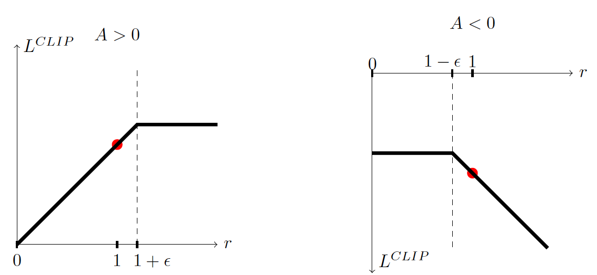
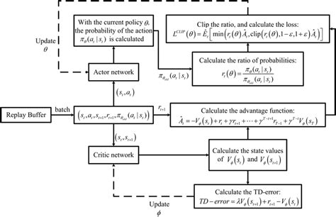

## 1. PPO 算法原理
**背景与动机：** Proximal Policy Optimization（PPO）算法由 OpenAI 的 John Schulman 等人在 2017 年提出。它属于策略梯度方法的一种改进，旨在解决标准策略梯度方法不稳定、大步更新容易导致性能崩溃的问题。在此之前，Trust Region Policy Optimization（TRPO）算法通过在策略更新时加入严格的 KL 散度约束来保证策略每次只做小幅度改进，从而实现稳定的单调提升，但 TRPO 需要二阶导数和复杂的共轭梯度算法实现，计算代价高且实现复杂。PPO 的提出正是为了**在保持策略更新稳定性的同时，简化实现难度**。实验表明，PPO 在采样效率、性能稳定性上可媲美 TRPO，但**只需使用一阶优化方法（如 SGD 或 Adam）即可实现**，无需复杂的二阶优化。

**PPO 两种策略更新方式：** PPO 实际上是一个策略优化方法的家族，主要包括两种变体：一是带**KL惩罚项**的方式（PPO-Penalty），即在目标函数中加入 KL 散度惩罚因子，动态调整其权重，使新旧策略的 KL 散度维持在期望范围；二是更常用的**截断策略目标**（PPO-Clip），即直接在目标函数中对新旧策略的概率比率进行裁剪，以限制每次更新的幅度。实践中，PPO-Clip 因为实现简单、稳定性好而成为主流，也就是 OpenAI 等机构使用的默认版本。下面将重点介绍截断版 PPO 的核心思想和目标函数设计。

**截断目标函数：** PPO-Clip 的关键在于定义**概率比率**$r_t(\theta)$来度量新旧策略在同一动作上的概率变化幅度：

$r_t(\theta) \;=\; \frac{\pi_{\theta}(a_t \mid s_t)}{\pi_{\theta_{\text{old}}}(a_t \mid s_t)} ,$

其中$\pi_{\theta}$是当前策略，$\pi_{\theta_{\text{old}}}$是策略更新前的旧策略。如果$r_t(\theta) > 1$，表示新策略在状态$s_t$下让动作$a_t$更加趋向于发生；反之若$r_t(\theta) < 1$，则新策略降低了该动作的概率。为了避免$r_t(\theta)$偏离1过多（对应策略改变太大），PPO 引入了**截断剪切操作**。截断版策略梯度的目标函数可以表示为：

$L_{\text{CLIP}}(\theta) \;=\; \mathbb{E}_t\Big[\,\min\big(r_t(\theta)\,\hat{A}_t,\;\text{clip}\big(r_t(\theta),\,1-\varepsilon,\,1+\varepsilon\big)\,\hat{A}_t\big)\Big],$

其中$\hat{A}_t$是优势函数的估计，$\varepsilon$是一个小的超参数（例如 0.1 或 0.2）。这个目标函数取原始概率比率优势$r_t(\theta)\hat{A}_t$和**截断后的概率比率优势**两者中的较小值，从而实现对策略更新幅度的限制。当优势$\hat{A}_t$为正时，如果$r_t(\theta)$尝试增大超过$(1+\varepsilon)$，截断操作会阻止策略优势继续变大；当优势为负时，若$r_t(\theta)$降低到小于$(1-\varepsilon)$，截断也会阻止策略过度减小该动作概率。通过这种方式，PPO **在目标函数层面内嵌了对策略更新幅度的限制**，近似实现了 TRPO 的“信赖域”效果，而无需显式计算二阶梯度或进行约束优化。



_图1：PPO 截断策略目标示意图。左图表示优势$A$_ 为正的情形，此时原始目标$r A$_（蓝线）在$r$_ 增大时单调上升，但 PPO 在$r>1+\varepsilon$_ 区间将增益截断（绿色虚线变为水平），避免策略过度更新。右图为优势$A$_ 为负时的情形，$r$_ 减小时原始目标$r A$_（蓝线）下降，PPO 在$r<1-\varepsilon$_ 时对目标值进行截断（红线水平），避免惩罚过度。红点表示策略更新的起始位置（$r=1$_ 对应旧策略）。_

通过上述截断策略，PPO 的**策略优化更加保守稳定**：当策略更新对提升收益非常有利时，也不会因为贪心而走得太远；当策略更新方向是有害的，截断机制则会给予显著的惩罚，促使梯度反向推动策略朝纠正方向发展。值得一提的是，PPO 论文也探讨了使用**自适应 KL 惩罚**的方法（PPO-Penalty），即给目标函数添加$\beta \cdot \mathrm{KL}(\pi_{\theta_{\text{old}}}|\pi_{\theta})$惩罚项并动态调整系数$\beta$控制新旧策略距离。然而实验证明剪切法（PPO-Clip）在实现简单性的同时，能取得更好的稳定性能，因此 PPO-Clip 更为常用。

**与 TRPO 的比较：** 总的来说，PPO 延续了 TRPO“限制策略改变量”的思想，都旨在防止策略更新步长过大引起性能崩溃。不同之处在于 TRPO 通过二阶近似和约束优化严格限制 KL 散度，而 PPO 则通过修改目标函数（剪切或软约束）实现类似效果，**算法实现更加简单高效**。这使得 PPO 更易于在复杂策略网络（例如带共享参数的 actor-critic 架构）中应用，并支持直接用自动微分框架实现梯度更新。实践经验表明，PPO 通常更容易调参，适用范围更广，而收敛性能与 TRPO 相当甚至更优。凭借在连续控制、离散动作（Atari 游戏）等各种任务中的出色表现，PPO 已成为深度强化学习领域**应用最广泛的策略优化算法**之一。

## 2. PPO 的 PyTorch 实现
**整体结构：** PPO 通常采用 Actor-Critic 架构实现，其中包含策略网络（Actor）和价值网络（Critic）。可以将 Actor 和 Critic 集成在**同一个模型**中，共享部分层然后输出各自的结果，也可以使用两个独立的神经网络。一个经典设计是共享一个隐层表示，然后 Actor 输出动作分布参数（对于连续动作环境通常输出均值和对数标准差，用于构造高斯分布；对于离散动作则输出各动作的概率），Critic 输出对应状态的价值估计$V(s)$。下面是一段 PPO 算法核心训练步骤的 PyTorch 风格代码示例（为便于说明做了简化，省略了并行采样、熵奖励等工程细节）：

```python
# 假设 actor_critic 是包含策略和价值的模型，已获得采样数据：old_states, old_actions, old_log_probs, returns, advantages
optimizer = optim.Adam(actor_critic.parameters(), lr=3e-4)
for epoch in range(epochs):                          # 对同一批数据进行多轮更新
    indices = np.random.permutation(len(old_states)) # 打乱索引实现小批量
    for start_idx in range(0, len(old_states), batch_size):
        mb_idx = indices[start_idx : start_idx + batch_size]
        states_b = old_states[mb_idx]
        actions_b = old_actions[mb_idx]
        old_log_b = old_log_probs[mb_idx]
        returns_b = returns[mb_idx]
        adv_b    = advantages[mb_idx]

        # 前向计算策略和价值
        mean, logstd, value_b = actor_critic(states_b)
        dist = torch.distributions.Normal(mean, logstd.exp())   # 连续动作策略分布
        new_log_probs = dist.log_prob(actions_b).sum(dim=-1, keepdim=True)
        # 计算概率比率 r(θ)
        ratio = torch.exp(new_log_probs - old_log_b)

        # 计算截断策略损失 L_CLIP
        surr1 = ratio * adv_b
        surr2 = torch.clamp(ratio, 1.0 - clip_param, 1.0 + clip_param) * adv_b
        policy_loss = -torch.min(surr1, surr2).mean()           # 取负号转化为损失（梯度下降最小化）

        # 计算价值函数损失
        value_loss = F.mse_loss(value_b, returns_b)

        # 总损失（熵奖励项此处省略）
        loss = policy_loss + vf_coef * value_loss
        optimizer.zero_grad()
        loss.backward()
        nn.utils.clip_grad_norm_(actor_critic.parameters(), max_grad_norm)  # 梯度裁剪
        optimizer.step()
```

上述代码实现了 PPO 更新的核心步骤：首先利用当前策略网络计算给定状态批次的动作概率 _new_log_probs_ 和状态价值 _value_b_，然后计算新旧策略的概率比率 `ratio`。接着构造**未截断**的策略收益 `surr1 = ratio * advantage` 和**截断后的**收益 `surr2 = clamp(ratio, 1-ε, 1+ε) * advantage`，取两者的最小值并加负号求平均作为策略损失（即$-L_{\text{CLIP}}$）。价值函数损失则使用MSE将 Critic 输出的价值$V(s)$回归到实际的回报（或称 _returns_，通常采用TD(lambda)或蒙特卡洛方式计算)。总损失是两者加权和（代码中策略损失和价值损失系数 _vf_coef_ 通常取 1.0；若添加熵奖励还需减去 _entropy_coef_$\times$熵）。然后对总损失执行反向传播，并进行梯度裁剪以增强训练稳定性，最后更新网络参数。

**采样与训练流程：** PPO 的训练遵循“交替采样-更新”的循环过程。具体步骤如下：

1. **采样数据：** 在当前策略$\pi_{\theta_{\text{old}}}$下，与环境交互采集一批轨迹数据（可以并行多个环境加速收集）。每条轨迹长度为$T$，汇总得到一个包含$N$条数据（状态-动作-奖励序列）的批次。通常 $N=\text{batch_size}$会设得较大以降低策略梯度的方差，如 2048、4096 等。
2. **计算奖励与优势：** 根据收集到的每条轨迹，计算每个时间步的累积折扣回报（称为 _返回_）。利用价值网络（Critic）估计每个状态的基准值$V(s_t)$，由此计算优势函数估计$\hat{A}_t = G_t - V(s_t)$，其中$G_t$是该状态起始的折扣累计回报。为降低方差、提高优势估计的稳健性，一般使用**广义优势估计**（GAE）方法来平滑计算$\hat{A}_t$。GAE 在计算优势时引入了参数$\lambda$（如 0.95）来折中偏差和方差，使得优势估计更稳定。
3. **构造 PPO 损失：** 将采样得到的数据视为固定数据集，以旧策略$\pi_{\theta_{\text{old}}}$为参考计算概率比$r_t(\theta)$，构建剪切策略目标$L_{\text{CLIP}}(\theta)$和（可选的）价值损失、熵项等，得到完整的 PPO 损失函数（见上文公式和代码实现）。
4. **多轮梯度更新：** 在保持采样数据不变的情况下，使用随机梯度上升（实现上等价于对上述总损失下降）对策略网络和价值网络执行$K$轮更新。每轮从采样批次中按一定 **minibatch** 大小抽取小批数据，计算梯度并更新参数。这样重复多次，以充分利用每批样本。
5. **更新旧策略参数：** 将$\theta_{\text{old}} \leftarrow \theta$，即将新参数作为下次采样的旧策略，继续下一循环。通常重复上述循环直至收敛或训练步数耗尽。



_图2：PPO 算法整体训练流程示意。Actor 从环境状态$s$_ 产生动作$a$_ 与环境交互收集奖励$r$_，Critic 估计状态价值用于优势计算。经验数据存入回放缓冲（PPO中一般不重复使用旧数据，即 on-policy，每次更新后清空缓冲）。一定步长后，将收集的数据用于多轮策略网络和价值网络的更新（图中“Update”步骤），更新完成后重置旧策略，再次采集数据。_

PyTorch 实现中，上述循环常表现为两个嵌套的`for`循环：外层循环处理采样-更新迭代，内层循环对每批数据进行$K$次小批量优化。需要注意的是，在实现细节上，为了提升性能和效果，通常会**对优势进行标准化**处理（减去均值除以标准差），对每个小批重新计算策略的 log概率和价值以保证对应当前参数，等等。这些工程细节在很多开源实现（如 OpenAI Baselines、CleanRL 等）中有体现，相关研究也总结了 PPO 实现需要注意的诸多细节。

## 3. 常见陷阱与调试建议
尽管 PPO 算法相对稳定和鲁棒，但在实际训练中仍有许多**超参数选择和实现细节**会显著影响效果。以下总结 PPO 实验中常见的陷阱和调优建议：

+ **学习率（Learning Rate）：** 学习率过高时，策略更新步伐过大，可能导致训练不稳定甚至收益崩塌；学习率过低则收敛缓慢，难以达到最优表现。一般采用自适应矩估计优化器（Adam）并需根据任务调整学习率，典型取值在$10^{-4}$量级。可以通过监控训练曲线的波动来调节学习率：若观察到策略收益剧烈震荡或下降，应适当降低学习率；反之收敛过慢则可酌情提高。
+ **剪切系数 **$\varepsilon$**：** 选择合适的裁剪范围对于PPO至关重要。$\varepsilon$通常设置在0.1到0.2之间。如果$\varepsilon$取值过大，策略更新约束变得宽松，PPO 可能退化为未经限制的策略梯度，从而失去稳定性；反之若$\varepsilon$太小，更新步幅将过于保守，导致策略收敛变慢。经验上，$\varepsilon=0.2$常作为默认值，并在此基础上根据 KL 散度等指标微调。
+ **采样批量大小：** 每次迭代收集的样本数量（即 batch size 或者每条轨迹长度$T$）会影响策略梯度估计的方差和稳定性。批量过小会导致估计噪声大，训练曲线抖动明显；批量过大则提高单次迭代计算成本。常用的设置是在一个并行环境步数积累 2048 或 4096 条样本后更新一次。总的原则是：**增大样本量可以换取更平稳的策略提升**，但会降低每单位样本的更新频率，要在计算资源允许范围内平衡二者。
+ **多轮小批更新次数 **$K$**：** PPO 允许对同一批数据进行多次梯度上升更新，但是更新轮数不能过多。一般设置$K=3\sim10$，如果$K$太大，则可能过度拟合这批采样数据，导致策略对新数据泛化变差。调试时可以观察每次策略更新的**KL散度**或**被截断的样本比例（clip fraction）**：若多轮更新后 KL 散度明显超出预期（例如超过 0.1），或者 clip fraction 很高（大量样本达到了剪切边界），说明策略更新幅度过大，可能需要减少$K$或降低学习率。
+ **值函数估计偏差：** 价值网络（Critic）的准确性对优势函数估计影响重大。如果 Critic 无法精确逼近环境的价值函数，优势估计将出现偏差，进而影响策略梯度方向。常见现象是策略陷入次优或收敛缓慢。应对方法包括：**增加价值网络的训练强度**（例如每次策略更新迭代多次价值网络或者提高价值损失权重$c_1$）以及增加 Critic 网络容量（更多层数或单元）。此外，可以引入**值函数截断**（即限制每次更新价值的变化幅度）来防止价值估计发散，这在某些实现中被证明有助于稳定训练。
+ **熵系数与探索：** PPO 通常会在目标中加入策略熵的奖励项（系数记为$c_2$）以鼓励探索。如果熵系数设置过大，策略可能长期保持高随机性，收益提升缓慢；若熵系数过小，则可能过早收敛到次优策略。实践中$c_2$一般取 0.01～0.02 左右。调参时可以观察策略的**熵值曲线**：熵值下降过快意味着探索不足，可适当提高$c_2$；熵值长期维持较高则考虑降低$c_2$。
+ **训练不稳定及调试：** 当 PPO 训练出现不稳定或收敛困难时，建议从以下方面排查：①**归一化优势**：确保优势经过减均值除方差的标准化处理，可显著稳定训练；②**学习率退火**：随着训练推进逐步降低学习率，避免后期震荡；③**观察关键指标**：定期打印 KL 散度、clip fraction、策略熵和价值损失等指标，判断是否策略更新过度（如KL剧增）或价值函数训练不足等；④**环境噪声和随机种子**：对于结果波动大的任务，多运行几次取平均，以分辨算法本身问题还是随机因素导致。

总的来说，PPO 作为当前最成功的策略优化算法之一，其核心思想是在策略梯度更新中引入适度的约束，从而达到**稳定训练与高效采样**的平衡。通过合理的超参数调节和技巧（如GAE、熵奖励、梯度裁剪等），已经在机器人的连续控制、游戏AI以及大规模预训练模型微调（如基于人类反馈的对话模型优化）等众多场景中取得了卓越的成果。

