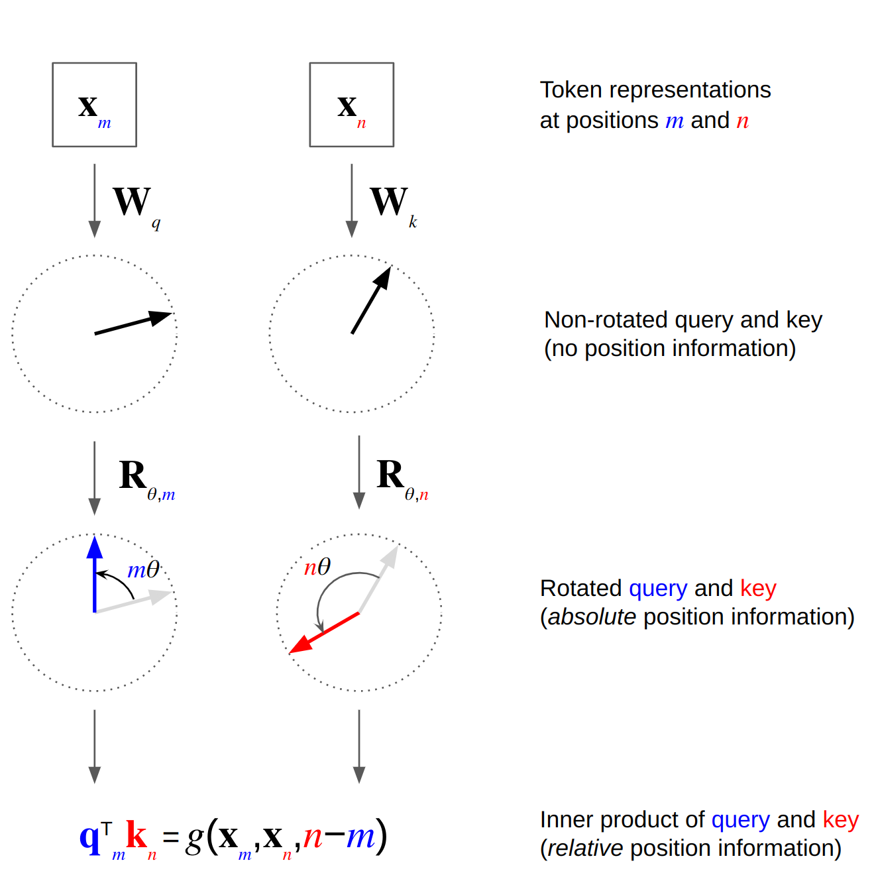

## 1 背景与动机
Transformer 自注意力对序列顺序不敏感，必须显式注入位置信息。早期采用固定正弦/余弦绝对编码或可学习绝对嵌入，但它们难以表达**相对距离**且对长度泛化能力有限。相对位置编码（RPE）虽能部分缓解，但实现复杂、速度慢。RoPE 通过**复数旋转**一次性同时编码绝对和相对位置信息，为长上下文、大模型推理带来计算与泛化优势。

## 2 RoPE是什么
在大多数 LLM 代码与论文的实现里，**RoPE 并不是“给词向量加一列坐标”的传统位置嵌入，而是在每个自注意力层内对 Query/Key 矩阵做一次按位置角度的旋转**：输入 token 先进入词表查找得到$h$，随后经线性投影分成$q,k,v$，接着仅对$q$、$k$进行 `apply_rotary_pos_emb`，再进入点积‑Softmax 计算注意力权重。这一步发生在 **Multi‑Head Attention 模块内部**，与词嵌入矩阵本身（token embedding）解耦。

RoPE 最早由 RoFormer 提出，其核心思想是：把查询$q$和键$k$视为偶数/奇数交错的二维向量对$(x_{2i},x_{2i+1})$，对第$p$位应用同一角度$\theta_p$的旋转变换  
$R_{\theta_p}\begin{pmatrix}x_{2i}x_{2i+1}\end{pmatrix}= \begin{pmatrix}x_{2i}\cos\theta_p - x_{2i+1}\sin\theta_p \ x_{2i}\sin\theta_p + x_{2i+1}\cos\theta_p\end{pmatrix}$ 
其中$\theta_p = p/10000^{2i/d}$与传统正弦编码同源。乘积$q^\top k$中旋转角度相减，自然产生相对位置偏差，因此自注意力仅依赖$p_q-p_k$。


** 性质**

+ **等变性**：旋转矩阵保持范数不变，避免幅值爆炸。
+ **相对距离单调衰减**：内积随距离增大而余弦衰减。
+ **无额外参数**：与可学习绝对嵌入相比，参数为零，显存占用更低。
+ **易于长文本插值/外推**：通过伸缩$\theta$或插值，可把预训练 2 k → 128 k tokens。




> **真实代码示例**
>
> **——StableLM‑Alpha 官方实现**
>

```python
cos, sin = rotary_emb(v, seq_len)          # 预取旋转系数  
q, k = apply_rotary_pos_emb(q, k, cos, sin, position_ids)  
```

+ **仅旋转 Q/K，不处理 V，是 LLaMA、StableLM、Phi‑3 等主流实现的共识**
+ **旋转操作位于注意力层里，因而 RoPE ≠ token embedding 的一部分；如果把 RoPE 提前到词嵌入阶段，相对位置信息在随后的线性投影中会被破坏，无法保证旋转角差等于相对距离**

**为什么选择在 Attention 内部旋转**

1. **相对位置信息天然保留**$q_i^\top k_j$中角度差$\theta_i-\theta_j$只取决于$i-j$，与绝对位置无关，实现了零参数的相对编码。
2. **计算/显存零额外开销** 旋转是逐元素乘加（或复数乘法），复杂度与原本点积相同；不需要为每个位置存表或向量。
3. **推理阶段可缓存 cos/sin** 相同长度只需一次预计算即可复用，在长上下文推理中比把位置向量加到$h$更节省带宽。

**常见误区澄清**

| **误解** | **事实与解释** |
| --- | --- |
| “RoPE 是另一种词嵌入” | 否。词嵌入负责语义，RoPE 仅在注意力求权重前对 $q,k$做旋转，从而把“位置信息”混入注意力分数，而非存进 token 向量。 |
| “RoPE 也要加到 Value” | 一般不加。$v$不参与 dot‑product，旋转对最终输出无用，反而浪费算力。部分实验对$v$旋转效果无显著提升。 |
| “换成 RoPE 只要改 Embedding 层” | 还需改 Attention。必须在所有自注意力层调用 `apply_rotary_pos_emb`；单独替换词嵌入层不会生效。 |


## 3 如何实现
### 3.1 PyTorch 伪代码
```python
def apply_rope(x):
    # x: (batch, seq, n_heads, head_dim)
    x_even, x_odd = x[..., 0::2], x[..., 1::2]
    pos = torch.arange(x.shape[1], device=x.device)
    theta = pos[:, None] / 10000 ** (torch.arange(head_dim//2) / (head_dim//2))
    sin, cos = theta.sin(), theta.cos()
    x_rot = torch.stack([x_even*cos - x_odd*sin,
                         x_even*sin + x_odd*cos], dim=-1)
    return x_rot.flatten(-2)
```

关键实现点：

1. 先对维度做 `reshape`/`view`，保证偶数-奇数配对。
2. 只对 **Query** 和 **Key** 旋转，**Value** 保持不变（LLaMA系做法）。
3. 在推理阶段缓存 `cosθ`, `sinθ` 以加速。

### 3.2 伸缩到长上下文
+ **Θ‑scaling**：将$\theta_p$除以系数 $s<1$（NTK-aware scaling）以线性拉伸频率。
+ **位置插值（PI）**：在更长序列上重新采样 $\theta$，不需改模型权重；实验显示 RoPE‑PI 在 32 k+ 长度保持困惑度平稳。
+ **YaRN**：微调少量 token，对 θ 动态缩放和分段 fine‑tune，可达 128 k 上下文且训练代价为前人 10%。
