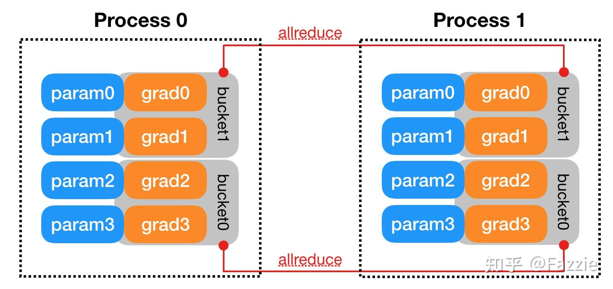
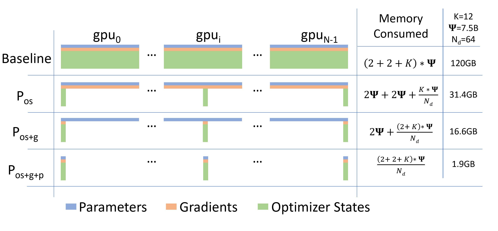

{{ render_tags() }}

## 1. 参数初始化与同步机制
在数据并行 (Data Parallel, DP) 训练中，每块 GPU 都保有一份完整的模型副本。训练开始时需要确保各 GPU 上模型参数**初始值一致**。通常的做法是在一个进程上初始化模型参数，然后将其广播同步到其他 GPU。例如，在 PyTorch DistributedDataParallel (DDP) 中，构造 DDP 对象时会使用 `ProcessGroup::broadcast()` 将 rank 0 进程的模型参数状态 (`state_dict`) 发送给所有其他进程。这样可以保证每个 GPU 上的模型副本从一开始就具有相同的权重值。如果模型包含缓冲区（如 BatchNorm 的均值/方差），DDP 也会在每次前向计算前广播同步这些缓冲区，从而保持模型的一致性。

另一种常见方式是使用相同的随机种子在每个 GPU 上独立初始化模型参数，但仍需通过上述广播机制来确保完全同步。总之，在训练的起点，各 GPU 的模型参数都是对齐的，没有差异。这为后续的同步更新奠定了基础。

## 2. 前向与反向传播过程
**前向传播（Forward Pass）：** 在每次训练迭代中，**各 GPU 会处理不同的输入数据子集**。通常将全局批次（batch）按等份划分给每个 GPU（例如采用 DistributedSampler 确保每个GPU读取不同的数据切片）。每个 GPU 使用本地的模型副本对自己的数据子集执行前向计算，产出预测结果和损失值。由于所有 GPU 上模型参数初始完全相同且尚未更新，因此针对不同数据计算出的梯度之前，各模型副本仍保持同步。前向传播阶段不需要跨 GPU 通信；每个 GPU 独立完成其计算。

**反向传播（Backward Pass）：** 随后，每个 GPU 基于其计算的损失，对本地模型执行反向传播，计算**对应于整个模型所有参数的梯度**。也就是说，尽管每个 GPU 只处理了全局批次的一部分样本，但它会为**模型的每一个参数**计算梯度（这些梯度反映了该GPU所见数据对参数的误差信号）。此时，不同 GPU 得到的梯度各不相同（因为输入数据不同）；每块 GPU 暂时各自拥有一份**完整的梯度张量集合**。这些本地梯度会存储在参数的 `.grad` 字段中，供后续优化步骤使用。

需要注意，在标准数据并行中，各 GPU **同步地**进行前向和反向计算，即各 GPU 都执行相同的计算图，只是数据不同。它们通常以锁步方式推进训练：一次迭代中所有 GPU 完成前向和反向后，才会进入梯度聚合和参数更新阶段。这样保证了数据并行训练在数学上等价于单 GPU 上大批量的训练（只是将大批次拆分到多卡）——前提是正确同步梯度和更新参数。

## 3. 梯度同步机制（All-Reduce）
每个 GPU 反向传播得到的是基于其本地数据的**局部梯度**。为了使多卡训练与单卡大批量梯度下降的结果一致，我们需要将所有 GPU 的梯度**聚合**（一般取平均）后再更新参数。DP策略中经典的做法是对梯度使用 **All-Reduce** 操作：把各GPU对应参数的梯度加起来（或取平均）并回收到每个GPU。这一过程通常在反向传播结束或过程中触发。

_图：环形 All-Reduce 通信拓扑示意，每个 GPU 仅与邻居直接交换梯度分片，从而避免单一节点成为瓶颈。_

在早期简单实现中，可以由一个“参数服务器”（比如主节点/GPU）收集所有梯度求和再广播回各GPU，但这种集中式方案通信开销随GPU数线性增长，易形成瓶颈。现代库（如 NCCL）普遍采用**Ring All-Reduce**环形算法来优化梯度同步效率。如上图所示，所有 GPU 逻辑上组成一个环，各 GPU 将自己梯度张量按块拆分并在环上逐步与邻居交换和规约。Ring All-Reduce 分为**Reduce-Scatter**（各GPU逐步累加得到一块全局和）和**All-Gather**（将各块全局和分发，使每GPU得到完整和）两个阶段。经过一轮环形传输后，每个 GPU 最终都会得到**全局梯度和**（或均值）的完整拷贝。相较参数服务器模式，环形算法充分利用每块GPU的带宽，避免单点瓶颈，并且总通信量更均匀、高效。

在具体实现上，PyTorch DDP 在梯度同步方面做了大量优化。DDP会在构造时为每个待训练参数注册一个autograd回调钩子，用于监听其梯度何时计算完毕。为了减少通信次数，DDP还将参数梯度划分进若干**桶（bucket）**中：例如将多 个小梯度张量拼合成较大的缓冲区。这些桶的大小可以通过 `bucket_cap_mb` 参数调整，一般默认上限为 25MB 左右。这样做的好处是可以以bucket为单位进行通信，降低通信调用频率并提高带宽利用率。

**梯度All-Reduce的触发时机与粒度：** 在反向传播过程中，当某些参数的梯度计算完成、对应的bucket填满时，DDP的梯度回调会立即触发一个异步的 All-Reduce 操作来同步该bucket中的所有梯度。也就是说，梯度的规约并不等到所有参数都处理完才一次性发生，而是与反向计算**交叠重叠**进行，从最后一层开始梯度一边生成一边就近通信。

_图：DDP 将每张卡上的梯度按参数划分到不同 bucket，中间采用钩子异步触发 All-Reduce（示例中 grad0 和 grad1 属于 bucket1，grad2 和 grad3 属于 bucket0）。梯度计算顺序与bucket划分相匹配时，可以最大化通信与计算重叠。_

如上图示例，假设模型有4个参数 `param0`-`param3`（在两张GPU的两个DDP进程中各有一份）。DDP按照逆序将参数分配入两个bucket：`bucket1` 包含 `grad0, grad1`，`bucket0` 包含 `grad2, grad3`。在反向过程中，若梯度产生顺序是 grad3→grad2→grad1→grad0（一般靠后的层梯度先计算完），那么当`bucket0`的所有梯度都已就绪时，会马上启动一次 All-Reduce 来同步这些梯度，而无需等待较靠前层的 grad0/1。接着 grad0/1 完成后同步 `bucket1`。这种设计使得通信开销隐藏在反向计算中，提高了并行效率。**All-Reduce的结果**是将同一参数的各GPU梯度取和（或平均)，并写回各GPU上该参数的 `.grad` 字段。因此，在反向传播全部结束时，不同GPU上对应参数的梯度张量内容**完全相同**。此时每块GPU都持有一份全局平均后的完整梯度。

总结来说，数据并行下梯度同步采用的是**逐参数（或逐bucket）All-Reduce**：各GPU内存中暂存完整梯度，但通过高速互联交换，最终每个梯度张量变为全局和/平均值。这保证了后续每块卡在更新时使用的梯度与单卡等效，同时通信模式（如Ring-AllReduce）也最大程度利用了并行通信带宽。

关于Ring All-Reduce的详细介绍，可以参见这篇博客：[https://blog.csdn.net/qq_46009046/article/details/135161029](https://blog.csdn.net/qq_46009046/article/details/135161029)

## 4. 优化器状态管理与参数更新
完成梯度同步后，各 GPU 拥有了相同的模型梯度，于是可以各自进行**本地的优化器步骤**（optimizer step）。从优化器的视角来看，每个GPU只是对自己的模型副本执行一次参数更新。由于所有GPU的参数初始相同且梯度也已同步为全局平均值，因此各GPU进行**相同的参数更新计算**，使得更新后它们的模型权重仍保持一致。这一过程无需额外通信：数据并行训练通过确保每次迭代所有模型副本梯度一致，来保证各副本参数同步演化。

以常用的 Adam 优化器为例，除了模型参数本身，每张 GPU 上**还维护了完整的优化器状态**，包括每个参数的一阶动量$m$（梯度的指数滑动平均）和二阶动量$v$（梯度平方的指数滑动平均)等。如果使用混合精度训练，通常还会为每个参数保存一份FP32精度的主副本（即权重的高精度拷贝，用于累积精细更新）。因此，在标准数据并行中，每个GPU针对**每个模型参数**都会存储如下状态:

+ **参数值**：模型的权重，本例中可为 FP16（用于前向反向计算）或 FP32（全精度副本）。
+ **梯度**：参数的当前梯度（反向传播后已同步为全局梯度）。
+ **优化器内部状态**：以 Adam 为例，包含与每个参数形状相同的一阶动量张量$m$和二阶动量张量$v$，通常为FP32格式。此外若参数本身是FP16，还会有对应的 FP32 主权重副本。

可以看到，每块GPU存储的优化相关数据远超出模型参数本身的大小。例如，若模型参数用16位表示，而优化器状态用32位表示，则单参数在每GPU上的总存储量约为参数的3-4倍（参数FP16占2字节，额外的FP32副本+ m + v 共约12字节，合计≈14字节，是FP16参数大小的7倍；若折算成相对于FP32参数的倍数则约3.5倍）。即使在全FP32训练下，Adam的$m$和$v$也使每参数存储膨胀至3倍大小。**更重要的是**，这些内存消耗在所有 GPU 间是完全**冗余重复**的：数据并行下每块卡都保存了一份**完整**且几乎相同的优化器状态拷贝。各GPU的$m$、$v$在数值上随训练迭代演进保持一致（因为它们经历了相同的更新），没有提供额外的信息量。

这种冗余带来了显著的内存开销。例如，Microsoft给出的案例中，一个模型使用Adam优化时，其优化器状态总计占用约18GB显存；在单机8卡数据并行训练时**每张卡都需要18GB**来存储这份状态，几乎耗尽了一块32GB GPU的大部分内存。这也是大模型无法直接用传统数据并行放进单卡的原因之一。然而，这18GB其实是在8张卡上重复了8次。如果能将其合理拆分到8卡上，那么每卡只需存储约2.25GB，就能够大幅降低单卡内存占用。

参数更新过程中，每个GPU依据同步后的梯度独立计算参数的新值，并相应更新本地的优化器状态 (例如更新 Adam 的$m$和$v$矢量)。由于各GPU梯度相同，更新公式也一致，故此步骤后各GPU的模型参数仍然完全相同。**然而代价是**：为了实现这一同步更新，所有GPU都各自维护了整套完整的参数和优化器状态。这种数据并行的原始策略虽然在计算上简单直接，但非常不利于大模型的内存规模扩展。

## 5. 冗余存储与通信瓶颈分析 (ZeRO 优化动机)
如上所述，**原始数据并行存在两个主要开销瓶颈**：

+ **存储冗余：** 每张 GPU 存储了模型的全部参数、副本梯度以及完整优化器状态（三者统称为模型状态**Optimizer+Parameter+Gradient**，即OPG）。对于$N$张显卡的数据并行，模型状态的内存开销被重复了$N$倍。当模型参数规模巨大时，这种线性放大导致单卡内存很快耗尽，成为训练更大模型的障碍。上节的分析表明，很多内存实际上被浪费在跨GPU重复存储相同的信息上。
+ **通信开销：** 每次反向传播都需要对所有参数的梯度执行 All-Reduce 同步。尽管借助Ring-AllReduce算法能够较好地利用带宽资源，但对于数十亿上百亿参数模型，梯度通信总量依然可观。All-Reduce通信本身不会改变总的数据传输量（需要传输所有梯度数据），并且必须在每次迭代都执行。这在多机分布式环境下尤其可能受网络带宽限制而形成新的瓶颈。

_图：ZeRO 提出的分片方案显著减少了单卡内存占用。左起第一栏为传统数据并行（Baseline DP）的内存分布：每张 GPU 保存完整的参数、梯度和优化器状态（OPG）。后续各栏展示 ZeRO-1/2/3 分阶段逐步对 OPG 进行分区后的内存变化，显存占用随阶段推进大幅下降。_

为了解决上述问题，Microsoft 提出了**零冗余优化器 (Zero Redundancy Optimizer, ZeRO)**。ZeRO 的核心思想是**利用数据并行集群的总内存，把原本在每卡完整存储的模型状态拆分（Shard/Partition）到各个GPU上**，从而消除重复存储。具体而言，ZeRO将优化拆分分为三个逐步增强的阶段，对应前述 OPG 的三个部分：

+ **ZeRO-1：优化器状态分区**（$P_{os}$） – 将如 Adam 的$m$、$v$等状态变量在进程间平均分割，每张卡仅保留其中一部分。此举理论上将 **内存占用降低约 N 倍**（例如8卡集群减少至原来的1/8），但 **通信量**不增加（因为仍需全梯度 All-Reduce）。实际效果约**4倍**内存缩减，因为对于Adam优化器状态通常占主导。
+ **ZeRO-2：优化器状态 + 梯度分区**（$P_{os+g}$） – 在ZeRO-1基础上，进一步将反向得到的梯度也按参数切分归各GPU持有一部分（通过将 All-Reduce 换为更精细的 Reduce-Scatter + All-Gather 实现）。这样每张卡只需保存局部梯度块而非全量梯度，再次将内存需求减半（总体相比原始约**8倍**减少)，通信量仍与全量All-Reduce相当。
+ **ZeRO-3：优化器状态 + 梯度 + 参数分区**（$P_{os+g+p}$） – 连模型参数本身也不再每卡完整保存，而是动态按需在各GPU间划分和Gather/Scatter。这使得模型的三类状态均实现按N等分存储，**单卡内存占用约为原来的 1/N**（理想情况下N倍减少)，突破了单卡内存限制。由于需要在前向和反向计算中及时收集/拆分参数，ZeRO-3 会引入一定的额外通信开销（一般约增加50%）。

通过上述分区策略，ZeRO 将原始数据并行训练的**内存冗余几乎完全消除**，使总的GPU集群显存得以充分利用。例如，即便训练一万亿参数规模的模型，只要总GPU显存足够大，ZeRO 理论上都能将模型拆分存储并顺利训练。同时，在ZeRO-1和ZeRO-2阶段，通信量与传统DP相同；到ZeRO-3阶段，通信量相对略有增加但可接受，从而保持了与数据并行接近的通信效率。换言之，ZeRO方案在**大幅降低单卡内存需求**的同时，仍保留了数据并行的计算和通信并行度优势。

**总结:** 标准数据并行策略下，参数、副本梯度和优化器状态的重复存储以及全量梯度通信是主要瓶颈。这导致单卡内存浪费和扩展性受限。通过深入理解这些张量在DP中的生命周期和开销，我们很自然地看到优化空间——这正是 ZeRO 出现的背景。ZeRO 针对性地消除了各GPU间的冗余数据存储，并优化了通信方式，使得我们能够训练远超单GPU显存容量的超大模型，同时将通信开销控制在合理范围内。这样，数据并行训练在**存储与通信效率**上都得到大幅改进，为大规模模型训练铺平了道路。
