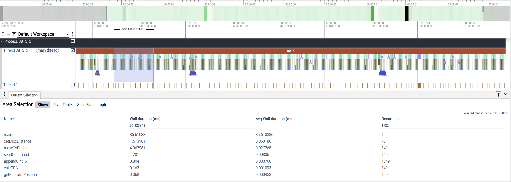

## 引言
你是否曾为优化 C++ 程序的性能而烦恼？面对复杂的代码，我们常常难以确定性能瓶颈究竟在何处。“是这个函数太慢，还是那个循环耗时太久？” 为了回答这些问题，我们通常会求助于重量级的性能分析工具，但它们往往配置复杂，使用门槛高。

今天，我向大家介绍一个我开发的开源项目——**YTracing**。它是一个轻量级的 C++ 事件跟踪库，旨在让你像打印日志一样，轻松地为代码添加性能“探针”，并通过现代化的前端工具直观地分析程序的运行时序。

**GitHub 仓库链接**: `https://github.com/zhangxiaochuan/YTracing`

## YTracing 的核心理念：低侵入，低开销，可插拔

YTracing 的设计哲学是尽可能地减少对业务代码的“侵入性”，并把对程序性能的影响降到最低。

它是如何做到的呢？答案是 C++ 开发者都非常熟悉的技术：**RAII (资源获取即初始化)**。

我们通过两个简单的宏来使用 YTracing：

* `YTRACING_FUNCTION()`: 在一个函数体的开始处调用，它会自动记录从函数开始到结束的整个时间跨度。
* `YTRACING_SCOPE("Some Custom Block")`: 用于精确测量一个特定代码块的执行时间。

当你将这些宏放入代码中时，一个 `AutoTracer` 对象会被创建。 它的构造函数会记录“开始”事件，而析构函数（在作用域结束时自动调用）则记录“结束”事件。

所有的事件数据都由一个全局的 `Collector` 单例进行收集。`Collector` 在一个独立的后台线程中运行，定期将收集到的事件批量写入磁盘。 这种生产者-消费者模式确保了在你的主业务线程中，记录事件的操作几乎是瞬时的，性能开销极小。

## 关键特性：零成本的条件编译

我们深知，追踪功能并非在所有时候都需要开启。在发布 Release 版本的二进制文件时，任何微小的额外开销都应该被消除。

YTracing 通过一个编译宏 `TRACING` 来完美解决这个问题。

* **当 `TRACING` 宏被定义时** (例如 `TRACING=1`)，`YTRACING_FUNCTION()` 和 `YTRACING_SCOPE()` 会被正常展开，追踪功能被激活。
* **当 `TRACING` 宏未定义时**，这些埋点宏会退化为一条无操作的空语句 `(void)0`。

这意味着，在你的发布版本中，所有与 YTracing 相关的代码都会被编译器彻底优化掉，**不会产生任何额外的性能开销，也不会引入任何运行时依赖**。你的二进制文件会像从未添加过追踪代码一样纯净。

## 快速上手指南

### 安装

#### 方式一：通过 apt 安装

1. 添加 PPA 仓库：
```bash
sudo add-apt-repository ppa:xiaochuanzhang/ytracing
sudo apt update
````

2. 安装开发包（包含头文件和库文件）：

```bash
sudo apt install libytracing-dev
```

#### 方式二：通过源码编译

1. 克隆项目：

```bash
git clone https://github.com/zhangxiaochuan/YTracing.git
cd YTracing
```

2. 编译并安装：

```bash
mkdir build && cd build
cmake ..
make -j$(nproc)
sudo make install
```

### 使用

#### 启用追踪功能


在代码中引入头文件，并使用以下两种方法记录追踪信息：

```cpp
#include <YTracing/YTracing.h>

void my_function() {
    // 方法一：YTRACING_FUNCTION
    // 记录整个函数的执行时间（作用域是整个函数）
    YTRACING_FUNCTION();

    // 模拟代码执行
    for (int i = 0; i < 1000000; ++i) {}

    {
        // 方法二：YTRACING_SCOPE("Custom Scope Name")
        // 记录一个自定义代码块的执行时间（作用域仅限于花括号内）
        YTRACING_SCOPE("Inner Loop Work");

        for (int j = 0; j < 500000; ++j) {}
    }
}
```
区别说明：

* YTRACING_FUNCTION()：自动以函数名作为事件名称，追踪整个函数的执行耗时。
* YTRACING_SCOPE("Name")：以自定义名称追踪特定代码块的执行耗时，适合函数内部的局部性能分析。


在 `CMakeLists.txt` 中添加以下定义以启用追踪，并链接YTracing库：

```cmake
add_definitions(-DTRACING=1) # 启用追踪功能，去掉这行即可关闭追踪功能

find_package(ytracing REQUIRED)
target_link_libraries(your_target PRIVATE YTracing::YTracingCore)
```

#### 使用 **YViewer** 进行追踪可视化

为方便对跟踪数据进行直观分析，**YTracing** 提供了 `YViewer` 命令行工具，帮助你可视化跟踪结果：

1. 完成编译之后，可以执行目标程序，并在工作目录下生成tracing_YYYYMMDD_HHMMSS文件夹，其中包括`.raw`格式的原始追踪数据。
2. 使用YViewer**将原始 `.raw` 文件转为 Perfetto 格式**  
   `YViewer` 会将由 YTracing 生成的 `.raw` 跟踪数据转换为可兼容 Perfetto 的 `trace.json` 格式。

3. **在 Perfetto UI 中查看与分析**  
   在浏览器中打开 [Perfetto Web UI](https://ui.perfetto.dev)，加载生成的 `trace.json` 后，你可以：
    - 查看函数调用与作用域嵌套关系及其耗时情况；
    - 通过缩放、平移、名称或时间过滤等操作，精准定位感兴趣的部分；
    - 在可视化时间线界面中分析并发执行、线程活动与函数执行时序等。

4. **推荐使用流程**

   ```bash
   # 1. 运行已插桩的程序：
   ./your_target
   # 此操作会生成一个包含 .raw 文件的 tracing_YYYYMMDD_HHMMSS 目录。

   # 2. 将跟踪数据转换为 JSON：
   YViewer tracing_YYYYMMDD_HHMMSS/
   # 将在tracing_YYYYMMDD_HHMMSS目录下将生成 trace.json 文件。

   # 3. 打开并可视化：
   浏览器打开 [Perfetto UI](https://ui.perfetto.dev) → 点击 “Open trace file” → 选择 `trace.json`。
   ```

   



## 常见问题排查 (FAQ)

**Q1: 集成后没有任何追踪数据生成，该如何排查？**

A: 请按以下步骤检查：

1.  **是否已启用追踪宏？** 确保你的顶层 `CMakeLists.txt` 中定义了 `TRACING=1` 宏。如果没有定义，所有埋点都会失效。
2.  **代码路径是否被执行？** 确认带有 `YTRACING_...` 宏的代码块确实在你的测试用例中被执行了。
3.  **运行目录是否可写？** YTracing 需要在程序运行的当前目录下创建 `tracing_...` 目录。请检查程序是否具有足够的写权限，以及终端是否有目录创建成功或失败的提示。

**Q2: 在多线程程序中使用 YTracing 需要额外设置吗？**

A: **完全不需要。** YTracing 在设计上就是线程安全的。

* `Collector` 内部使用 `std::mutex` 来保护数据收集过程，你可以在任意线程中直接使用 `YTRACING_...` 宏，无需任何特殊代码。
* **Pro-tip**: 为了在 Perfetto UI 中更好地区分和分析并发关系，建议为你的追踪事件采用一套统一的命名规范，例如 `phase:stage:detail`（如 `rendering:shadow_pass:compute_shader`），这样可以更清晰地看出不同线程正在执行的任务阶段。

**Q3: 如何将 YTracing 的转换流程接入到 CI/CD 中？**

A: YTracing 非常适合用于 CI/CD 流程中的性能回归测试。

1.  **产出原始数据**: 在你的 CI 作业中，编译并运行你的测试用例。确保测试能触发关键的代码路径，从而生成包含跟踪数据的 `.raw` 文件。
2.  **转换并归档**: 在后续步骤中，编译 `YViewer` 工具，用它将上一步生成的 `tracing_...` 目录批量转换为 `trace.json` 文件。
3.  **上传工件**: 将生成的 `trace.json` 作为 CI/CD 作业的工件 (Artifact) 上传。这样，每次代码变更后，你都可以下载该文件进行性能对比，检查是否存在非预期的性能衰退。

**Q4: YTracing 会不会有明显的性能损耗？**

A: YTracing 的核心设计目标之一就是**轻量化**。它通过异步和批量写入来最小化 I/O 开销。但需要明确的是，任何形式的追踪都必然存在开销。
我的建议是：

* **控制粒度**: 仅对你关心的关键代码路径开启追踪，避免在紧密循环内部等极度频繁调用的地方进行不必要的埋点。
* **按需开启**: 在 Debug 或专门的 Profiling 构建类型下使用。对于最终的 Release 版本，可以通过 CMake 选项关闭 `TRACING` 宏，实现零成本部署。

## 总结与展望

YTracing 提供了一种介于“手动 `std::chrono` 计时”和“重型性能分析器”之间的、优雅的中间方案。它足够简单，可以随时集成到你的项目中进行快速调试；也足够强大，能通过 Perfetto UI 提供专业的时序分析视图。它的“可插拔”特性让你可以毫无顾虑地在生产代码中保留埋点，只在需要时开启，真正做到了“零成本”监控。

这个项目目前托管在 GitHub 上，我们欢迎任何形式的贡献——无论是提交 Bug、提出功能建议，还是贡献代码。如果你觉得 YTracing 对你有帮助，请给它一个 Star！

**立即体验 YTracing，让性能分析变得前所未有的简单！**
